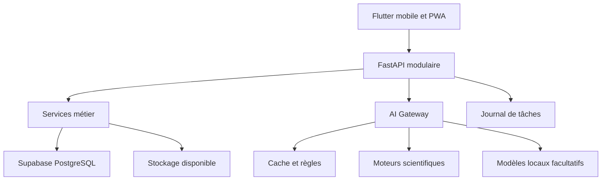

# PLATEFORME E-LEARNING CAMEROUN

## Cahier des charges maître consolidé — Intelligence artificielle, automatisation et exploitation à coût initial nul

**Version :** 1.0 — 2 septembre 2026
**Statut :** Document de référence consolidé
**Objectif de lancement :** première version stabilisée au plus tard durant la troisième semaine de septembre 2026

---

## Avertissement de lecture

Ce document met en commun les besoins exprimés dans la conversation transmise et les vingt-quatre modules d'intelligence artificielle élaborés ensuite. Il corrige une ambiguïté essentielle : le propriétaire du projet ne souhaite, pour le moment, souscrire **aucun service payant**, louer **aucun serveur ou GPU**, acheter **aucune API**, ni engager un coût récurrent.

Les noms de modèles, produits ou services cités dans la conversation d'origine ne constituent donc ni des choix définitifs ni des dépendances. Toute affirmation technique non confirmée sur une version future d'un modèle doit être vérifiée avant implémentation. L'architecture repose sur des interfaces interchangeables, des moteurs déterministes et des composants locaux, et non sur une promesse commerciale d'un fournisseur.

> **Règle absolue de la première version : zéro dépense nouvelle et zéro engagement financier.** Toute fonction nécessitant une carte bancaire, un abonnement, une facturation par requête, un serveur payant, un GPU loué, un SMS payant ou une messagerie professionnelle payante reste désactivée jusqu'à une décision explicite ultérieure.

---

# 1. Vision générale

La plateforme est une application e-learning camerounaise déjà amorcée. Elle ne doit pas être reconstruite de zéro. La couche IA doit améliorer l'existant : automatiser les tâches répétitives, enrichir l'expérience des élèves, assister les enseignants et donner au Super Admin une vision claire et contrôlable de toute la plateforme.

La cible n'est pas un simple lecteur de PDF. L'élève doit utiliser une application moderne, mobile-first, responsive, attractive et interactive sur téléphone, tablette et ordinateur. Les cours sont des objets pédagogiques structurés composés de texte, formules, exemples, exercices, médias, simulations, évaluations et remédiations.

Le principe directeur est le suivant :

> **L'IA prépare, recherche, classe, propose et explique. Les moteurs vérifient. L'humain supervise, corrige, autorise et décide.**

## 1.1 Existant à préserver

L'administration Flutter comprend notamment les modules suivants :

- `academic_tree` ;
- `content_management` ;
- `exams_events` ;
- `subscriptions` ;
- `users_roles` ;
- `system_settings` ;
- `dashboard` ;
- `auth`.

La cible technique demeure Flutter mobile/web PWA, FastAPI et Supabase/PostgreSQL. Toute intervention devra commencer par un audit du code, des migrations et des politiques d'accès existantes.

## 1.2 Utilisateurs

- Élève ;
- Parent ou responsable autorisé ;
- Enseignant ;
- Correcteur ;
- Conseiller d'orientation ;
- Responsable de stage ;
- Gestionnaire de contenu ;
- Administrateur scolaire ;
- Administrateur financier ;
- Super Admin ;
- Partenaire ou sponsor avec accès strictement limité.

## 1.3 Contraintes non négociables

- aucune API commerciale d'IA obligatoire ;
- aucune dépense nouvelle pour la V1 ;
- aucune carte bancaire utilisée pour activer un essai ;
- fonctionnement utile même lorsque l'IA lourde est indisponible ;
- contenus essentiels accessibles aux comptes gratuits ;
- priorité au téléphone et aux appareils modestes ;
- fonctionnement hors ligne pour les apprentissages essentiels ;
- français, anglais et italien prévus ;
- respect des deux sous-systèmes éducatifs camerounais ;
- protection renforcée des mineurs ;
- validation humaine des contenus officiels et décisions sensibles ;
- conservation de la provenance, des versions et des audits ;
- distinction entre titulaire du compte, titulaire du profil, bénéficiaire et payeur.

---

# 2. Ce que signifie réellement « gratuit et quasi illimité »

Il n'existe pas de service distant professionnel, puissant, permanent, sans limite et garanti à coût nul. Le projet ne doit donc pas dépendre d'une telle promesse. L'usage quasi illimité est obtenu autrement.

## 2.1 Mécanismes retenus

1. **Calcul déterministe :** SymPy, moteurs de graphes, règles, algorithmes de progression et simulateurs exécutent les tâches qui ne nécessitent pas un LLM.
2. **Contenus prégénérés :** les cours, narrations, exercices et médias sont produits une fois sur la machine disponible, contrôlés, puis réutilisés.
3. **Cache :** une explication validée ou un média n'est pas régénéré pour chaque élève.
4. **Modèles locaux légers :** seulement si le matériel existant peut les exécuter correctement.
5. **Hors-ligne :** cours, exercices, jeux et petites simulations restent utilisables sans serveur IA.
6. **Files d'attente :** les productions lentes sont différées ; elles ne bloquent ni les examens ni l'application.
7. **Dégradation contrôlée :** si un modèle est absent, le système revient vers une ressource validée, une règle ou un exercice déterministe.

## 2.2 Fonctions activables sans nouveau coût

| Fonction               | Solution retenue                                           |
|------------------------|--------------------------------------------------------------|
| Formules               | LaTeX canonique, KaTeX, MathJax en secours                  |
| Calcul mathématique    | SymPy                                                        |
| Graphes                | Plotly, ECharts, JSXGraph                                    |
| Recherche documentaire | PostgreSQL FTS, pgvector et embeddings locaux si possibles    |
| Exercices variables    | modèles paramétriques internes                               |
| Progression            | règles et calcul statistique                                 |
| Révision espacée       | algorithme local                                              |
| Simulations légères    | Flutter Canvas, Flame, JavaScript local                      |
| OCR                    | Tesseract ou PaddleOCR local                                  |
| Transcription          | Whisper local lorsque le matériel le permet                  |
| Synthèse vocale        | Piper local lorsque disponible                                |
| PDF                    | LaTeX ou génération locale                                    |
| Notifications          | in-app ; push gratuit si disponible sans engagement          |

## 2.3 Fonctions désactivées au lancement si elles impliquent un coût ou une lourdeur excessive

- location de GPU ;
- génération vidéo en temps réel ;
- visioconférence massive auto-hébergée sans infrastructure disponible ;
- SMS payants ;
- WhatsApp Business payant ;
- génération d'images lourde demandée librement par chaque élève ;
- stockage vidéo illimité ;
- modèles très volumineux exigeant un serveur spécialisé ;
- API commerciales de texte, image, voix, musique ou vidéo ;
- service gratuit nécessitant une carte et susceptible de facturer automatiquement.

Ces fonctions peuvent exister dans l'architecture sous forme de connecteurs désactivés, sans être promises dans la V1.

---

# 3. Architecture fonctionnelle des vingt-quatre modules IA

## Module 1 — AI Gateway et routeur de tâches

Point d'entrée unique de toutes les demandes IA. Il authentifie l'utilisateur, vérifie les permissions, classe la tâche, masque les données inutiles et choisit la méthode la moins coûteuse : cache, règle, moteur scientifique, petit modèle local ou file différée.

**Exigences :** registre de modèles, tâches autorisées, niveau de confidentialité, journalisation, délai maximal, refus des actions non permises, connecteurs externes désactivés par défaut.

**Acceptation :** aucun module ne contacte directement une IA externe ; l'application continue à fonctionner si tous les modèles génératifs sont arrêtés.

## Module 2 — RAG pédagogique et graphe de connaissances

La plateforme indexe uniquement les programmes, cours, référentiels et ressources autorisés. Les documents sont découpés par chapitre, définition, méthode, exercice ou procédure. Chaque fragment conserve sa source, sa version, ses permissions et son niveau de validation.

Le graphe relie pays, sous-système, classe, matière, chapitre, leçon, compétence, prérequis, exercice et ressource.

**Acceptation :** toute réponse pédagogique importante ouvre la source utilisée ; les examens confidentiels restent exclus de l'index général ; l'absence de source est clairement signalée.

## Module 3 — Système multi-agents contrôlé

Agents prévus : orchestrateur, programme, contenu, examens, sciences, technique, commerce, étudiant, enseignant, parent, administration, récompenses, notifications, médias, qualité et sécurité.

Les agents ne sont pas nécessairement des modèles séparés. Il s'agit d'abord de rôles, prompts, outils et permissions distinctes. Un même petit modèle local peut exécuter plusieurs rôles.

**Règle :** les agents préparent des brouillons ; ils ne modifient pas seuls une note, un paiement, un rôle, un examen ou une publication officielle.

## Module 4 — Tuteur multimodal de l'élève

Le tuteur explique, questionne, donne des indices progressifs, vérifie les prérequis et propose des exercices similaires. Il peut recevoir du texte, une image ou de l'audio si les moteurs locaux sont disponibles. Il ne donne pas automatiquement la solution complète et cite les cours autorisés.

**Mode gratuit prioritaire :** RAG, réponses validées, règles, calculatrice, SymPy, OCR et modèles locaux facultatifs. Une panne du LLM déclenche une explication prévalidée.

## Module 5 — Copilote enseignant

Il aide à préparer plans de cours, exercices, évaluations, barèmes, corrigés, variantes et remédiations. L'enseignant peut modifier un bloc, verrouiller une question, régénérer une section ou publier après contrôle.

**Interdiction :** aucune publication officielle automatique sans politique explicite ; aucun contenu ne doit être recopié illégalement depuis un manuel.

## Module 6 — Copilote Super Admin

Il détecte contenus incomplets, doublons, programmes à actualiser, documents sans droits, tâches échouées, problèmes de sécurité et anomalies. Il produit des rapports et propose des actions.

Les actions sensibles passent par les services métier et par une confirmation humaine. Le copilote ne reçoit jamais les secrets ni les numéros de paiement complets.

## Module 7 — Copilote parent

Il résume la progression autorisée, les échéances et les pistes d'accompagnement. Il traduit les indicateurs techniques en langage simple et limite les alertes anxiogènes.

Le parent ne reçoit pas automatiquement les conversations du tuteur, les données privées d'orientation ou toutes les activités. Les permissions dépendent de la relation configurée.

## Module 8 — Centre de notifications intelligent

Canaux V1 : in-app et, si possible sans coût nouveau, push. Email uniquement dans une limite gratuite fiable. SMS et WhatsApp restent désactivés tant qu'ils impliquent une dépense.

Le moteur regroupe les nouveautés, respecte les vacances, les horaires et la priorité, puis évite le spam. Les notes sensibles ne sont pas affichées sur un écran verrouillé.

## Module 9 — Récompenses, cadeaux et célébrations

Le moteur gère badges, avatars, thèmes, certificats, félicitations et contenus bonus. Les animations sont locales et légères. Les cadeaux physiques, crédits téléphoniques, jours premium ou récompenses financées ne sont jamais promis automatiquement : ils exigent budget, partenaire et validation.

Une récompense pédagogique ne doit pas pousser l'enfant à acheter ni à passer un temps d'écran excessif.

## Module 10 — Fabrique multimédia

Priorité : réutilisation d'un média validé, puis génération par code (SVG, Canvas, graphique), puis ressource libre, puis modèle local si le matériel le permet.

Les diagrammes scientifiques sont produits depuis des données structurées. Les vidéos sont de préférence assemblées à partir de scènes, diagrammes, narration et sous-titres, puis prégénérées. La génération vidéo lourde en direct reste désactivée.

## Module 11 — Adaptation et parcours personnalisé

Chaque élève possède un jumeau pédagogique : compétences observées, prérequis, erreurs, autonomie, rétention et progression. Ce profil n'est pas un diagnostic psychologique.

Le moteur recommande révision, exercice, simulation, pause ou intervention humaine. Une réussite isolée ne suffit pas à déclarer une compétence acquise. Les recommandations restent expliquées et modifiables par l'enseignant.

## Module 12 — Génération de cours, exercices et examens

Chaque cours est un objet structuré, non un bloc de texte. Les questions possèdent compétence, difficulté, réponse, barème, source, solution et statut.

Les mathématiques et sciences utilisent des modèles paramétriques et des vérificateurs déterministes. Les variantes antifraude doivent rester équivalentes. Les sujets et corrigés ont des permissions séparées.

## Module 13 — Correction, résultats, bulletins et remédiation

QCM, valeurs, formules et codes sont corrigés par moteurs spécialisés. L'IA peut assister pour les textes ouverts mais l'enseignant valide les notes importantes. L'original d'une copie scannée est conservé ; une incertitude OCR est soumise à un humain.

Le système gère points partiels, erreur propagée, contestation, double correction, appréciations respectueuses et bulletins configurables.

## Module 14 — Laboratoires virtuels et ateliers professionnels

Les simulations couvrent mathématiques, physique, chimie, biologie, électricité, mécanique, automatisme, informatique, bâtiment, agriculture, commerce, comptabilité, logistique et hôtellerie.

L'IA construit le scénario et explique ; les moteurs déterministes calculent. Les activités dangereuses restent conceptuelles et préventives. Aucun compte élève ne commande une machine réelle.

## Module 15 — Orientation scolaire et professionnelle

Le système explore intérêts, compétences, filières, métiers, formations, stages, bourses et entrepreneuriat. Il présente plusieurs scénarios et un plan de progression.

Une faiblesse actuelle ne ferme jamais définitivement une voie. Les dates, frais et conditions d'admission doivent être sourcés et datés. L'IA ne décide ni passage, ni orientation, ni exclusion.

## Module 16 — Abonnements, paiements et parrainage

Le modèle distingue obligatoirement : titulaire du compte, titulaire du profil, bénéficiaire et payeur. Un élève peut payer lui-même ; un parent, un tiers ou une institution peut payer sans devenir propriétaire du profil.

Dans la V1 zéro dépense, aucun connecteur payant ne sera activé tant qu'une solution autorisée n'est pas déjà disponible. Le module et ses données peuvent être préparés, mais l'application ne doit pas engager un coût.

## Module 17 — Authentification par code personnel

Sur un appareil reconnu, l'utilisateur sélectionne son profil et saisit son propre code. Le code est vérifié seulement contre ce profil. Le système ne cherche jamais à quel autre utilisateur appartient un code saisi.

Plusieurs comptes sont autorisés sur un téléphone, mais leurs sessions, données locales et historiques restent séparés. Un nouveau téléphone exige une preuve plus forte. Les administrateurs utilisent une authentification renforcée.

## Module 18 — Bibliothèque et recherche intelligente

La bibliothèque gère PDF, cours, exercices, images, audio, vidéos, simulations, programmes et documents techniques. Les originaux sont conservés ; les versions, droits et licences sont tracés.

La recherche hybride combine mots exacts, sens, programme, compétence et qualité. Les annotations, collections de classe et téléchargements hors ligne sont prévus.

## Module 19 — Collaboration et classes virtuelles

La V1 privilégie annonces, forums, messagerie, groupes, projets et partage de ressources. Les inconnus ne peuvent pas contacter librement un mineur. Les échanges adultes-mineurs sont institutionnels et modérés.

La visioconférence auto-hébergée est une option ultérieure, car elle est lourde en bande passante et serveur. Elle ne doit pas bloquer le lancement à zéro coût.

## Module 20 — Analytique institutionnelle

Les tableaux de bord suivent progression, contenus, examens, activité, sécurité, synchronisation et infrastructure. Chaque indicateur possède une définition et une version.

Les corrélations ne sont pas présentées comme des causes. Les petits groupes sont protégés. Les données pédagogiques ne sont jamais utilisées pour cibler commercialement les difficultés d'un élève.

## Module 21 — Accessibilité, inclusion et langues

Grand texte, contraste, clavier, lecteur d'écran, réduction des animations, sous-titres, transcriptions, alternatives au glisser-déposer et mode faible consommation sont intégrés dès la conception.

L'IA peut reformuler, traduire ou décrire, mais ne pose aucun diagnostic et n'attribue aucun aménagement officiel. Français et anglais respectent leurs référentiels scolaires propres ; l'italien est prévu pour l'interface et les contenus pertinents.

## Module 22 — Cybersécurité et protection des données

Classification, minimisation, RLS, chiffrement, journaux, sauvegardes, gestion des secrets, contrôle des fichiers, protection des mineurs et plan d'incident sont obligatoires.

Les modèles n'accèdent jamais directement à toute la base. Ils proposent une action ; un service métier vérifie l'identité, les permissions et les paramètres avant exécution. Les secrets ne sont jamais inclus dans un prompt.

## Module 23 — Infrastructure zéro coût et hors-ligne

La V1 utilise uniquement l'infrastructure déjà possédée et les offres gratuites ne nécessitant aucun engagement. Les tâches lourdes peuvent être exécutées sur l'ordinateur du propriétaire puis publiées.

L'architecture cible reste un monolithe FastAPI modulaire, une base Supabase/PostgreSQL gratuite dans ses limites, du stockage contrôlé, une file légère et des packs hors ligne. Aucun GPU loué ni serveur supplémentaire ne fait partie de la V1.

## Module 24 — Intégration, migration et lancement

Le code existant est audité, sauvegardé puis étendu par migrations additives. Chaque exigence est reliée à un écran, une API, une table, une permission et un test.

La V1 de septembre doit se concentrer sur les parcours qui fonctionnent déjà ou peuvent être stabilisés rapidement. Les fonctions lourdes sont masquées par feature flags et ajoutées après le lancement.

---

# 4. Structure pédagogique canonique

## 4.1 Hiérarchie

```text
Pays
└── Sous-système éducatif
    └── Type d'enseignement
        └── Filière / spécialité
            └── Classe
                └── Matière
                    └── Chapitre
                        └── Leçon
                            └── Notion / compétence
```

## 4.2 Page d'entrée d'un chapitre

- titre et illustration pertinente ;
- histoire scientifique, historique ou professionnelle lorsque pertinente ;
- situation concrète camerounaise ;
- question déclenchante ;
- utilité du chapitre ;
- objectifs ;
- compétences ;
- prérequis ;
- liste des leçons ;
- bouton de démarrage ;
- possibilité de télécharger le chapitre.

## 4.3 Structure d'une leçon

1. situation déclenchante ;
2. objectifs ;
3. prérequis ;
4. observation ou découverte ;
5. explication progressive ;
6. définitions et propriétés ;
7. démonstrations si nécessaires ;
8. exemples guidés ;
9. méthodes et astuces ;
10. erreurs fréquentes ;
11. application immédiate ;
12. exercices gradués ;
13. mini-évaluation ;
14. résumé et fiche « à retenir ».

L'interface ne doit pas obligatoirement afficher ces quatorze éléments sous forme de quatorze grands titres. Le moteur de rendu les transforme en expérience fluide.

## 4.4 Exercices

- immédiats après une notion ;
- fondamentaux ;
- entraînement ;
- application ;
- raisonnement ;
- approfondissement ;
- situation de vie ;
- fin de chapitre ;
- pluri-chapitres ;
- adaptatifs ;
- mode examen.

## 4.5 Checkpoint de chapitre

L'élève distingue lecture et maîtrise : notions acquises, notions à renforcer, test de chapitre, remédiation et passage au chapitre suivant.

---

# 5. Expérience utilisateur

## 5.1 Accueil élève

- progression ;
- parcours du jour ;
- matières ;
- prochaine activité ;
- recommandations ;
- téléchargements ;
- notifications utiles ;
- récompense récente ;
- accès au tuteur.

## 5.2 Écran de cours

- blocs interactifs ;
- texte lisible ;
- formules KaTeX ;
- images et diagrammes ;
- audio facultatif ;
- questions intégrées ;
- résumé ;
- signets ;
- progression ;
- mode hors ligne.

## 5.3 UX Composer

Le contenu canonique choisit son rendu selon la nature de l'information : graphique pour une fonction, simulation pour un mouvement, chronologie pour l'histoire, audio pour la prononciation, diagramme pour un système et cartes pour une procédure.

Le PDF reste un export imprimable, jamais la structure maîtresse de l'application.

---

# 6. Architecture technique zéro coût



## 6.1 Ordre de réponse

```text
Cache validé
→ règle ou ressource prévalidée
→ moteur scientifique
→ petit modèle local disponible
→ tâche différée sur la machine du propriétaire
→ message clair d'indisponibilité partielle
```

## 6.2 Composants envisagés

| Domaine        | Composants possibles, sous réserve de licence et de test  |
|-----------------|-------------------------------------------------------------|
| Mobile/web      | Flutter                                                     |
| Backend         | FastAPI                                                     |
| Base            | Supabase/PostgreSQL                                         |
| Vecteurs        | pgvector                                                    |
| Mathématiques   | SymPy, KaTeX, MathJax                                        |
| Graphes         | Plotly, ECharts, JSXGraph                                    |
| 3D              | Three.js, 3Dmol.js                                           |
| Chimie          | RDKit, Cantera                                               |
| Circuits        | ngspice                                                       |
| Simulations 2D  | Flutter Canvas, Flame, Matter.js/Rapier selon intégration     |
| OCR             | Tesseract, PaddleOCR                                          |
| Parole          | Whisper local, Piper local                                    |
| Conversion      | FFmpeg, LibreOffice contrôlé                                   |

GeoGebra, PhET ou d'autres services peuvent être référencés uniquement après vérification de leurs licences et conditions commerciales. Ils ne sont jamais obligatoires.

---

# 7. Données et objets principaux

Entités essentielles :

- `accounts` ;
- `profiles` ;
- `account_profile_relationships` ;
- `registered_devices` ;
- `roles` et `permissions` ;
- `institutions` ;
- `academic_years` ;
- `curricula` ;
- `levels`, `tracks`, `subjects` ;
- `competencies` et `prerequisite_edges` ;
- `courses`, `chapters`, `lessons`, `content_blocks` ;
- `question_bank_items` ;
- `assessments`, `submissions`, `grading_events` ;
- `student_competency_states` ;
- `learning_recommendations` ;
- `library_resources`, `resource_versions`, `document_chunks` ;
- `notifications` ;
- `reward_rules`, `reward_events` ;
- `orders`, `payment_transactions`, `subscriptions`, `entitlements` ;
- `simulation_definitions`, `simulation_sessions` ;
- `audit_events`, `security_incidents` ;
- `background_jobs`, `offline_sync_batches`.

Toutes les tables sensibles appliquent des politiques d'accès côté serveur et, avec Supabase, des politiques RLS testées.

---

# 8. Paiement, gratuité et publicité

Le projet prévoit le modèle de données nécessaire aux abonnements, mais la V1 ne doit pas activer un service qui crée une dépense nouvelle.

## 8.1 Relations financières

Un abonnement conserve séparément :

- l'acheteur ;
- le payeur ;
- le bénéficiaire ;
- le titulaire du profil ;
- la source du financement.

Un paiement par un parent, un élève ou un tiers ne transfère jamais la propriété du profil ni l'accès à ses données privées.

## 8.2 Publicité

Si une publicité est introduite plus tard, elle doit être contextuelle, validée et limitée. Aucun ciblage selon les difficultés scolaires, aucune publicité pendant les examens et aucune catégorie inadaptée aux mineurs.

---

# 9. Sécurité et contrôle humain

## 9.1 Actions par niveau

| Niveau      | Exemple                            | Règle                                    |
|-------------|-------------------------------------|--------------------------------------------|
| Automatique | rechercher une ressource autorisée  | journalisation                              |
| Brouillon   | préparer un cours                   | validation avant publication                |
| Sensible    | modifier une note ou un droit       | permission et confirmation                  |
| Critique    | rôle, remboursement, examen futur   | contrôle renforcé ou double validation      |

## 9.2 Interdictions

- secrets ou mots de passe dans un prompt ;
- accès général du modèle à la base ;
- publication automatique d'un contenu scientifique non vérifié ;
- sanction automatique fondée sur une prédiction ;
- reconnaissance faciale générale des élèves ;
- clonage de voix sans consentement ;
- commande d'une machine dangereuse depuis un compte élève ;
- examen confidentiel dans le RAG général ;
- collecte de données « au cas où » ;
- publicité ciblée sur la vulnérabilité scolaire.

---

# 10. Périmètre de la V1 de septembre

Le délai impose une V1 réduite mais stable.

## 10.1 Indispensable

- audit et sauvegarde de l'existant ;
- authentification et rôles fiables ;
- arbre académique ;
- administration des contenus ;
- accueil élève modernisé ;
- cours interactifs ;
- exercices déterministes ;
- progression simple ;
- recherche textuelle ;
- RAG initial sur contenus validés si exécutable sans coût ;
- code personnel sur appareil reconnu ;
- notifications in-app ;
- stockage local des cours essentiels ;
- synchronisation ;
- sauvegarde et journalisation.

## 10.2 Après stabilisation

- correction assistée avancée ;
- OCR massif ;
- modèles locaux plus exigeants ;
- simulations étendues ;
- récompenses physiques ;
- messageries payantes ;
- visioconférence ;
- génération d'image et vidéo ;
- jumeaux numériques ;
- analytique prédictive.

---

# 11. Calendrier proposé

## 2–4 septembre : audit et gel de la V1

- exécuter le projet ;
- inventorier les modules ;
- analyser les migrations et RLS ;
- recenser les défauts ;
- sauvegarder ;
- choisir les fonctions réellement livrables.

## 5–9 septembre : stabilisation

- authentification ;
- rôles ;
- administration ;
- contrats API ;
- erreurs ;
- sauvegardes ;
- préproduction.

## 10–14 septembre : parcours essentiels

- Élève ;
- cours ;
- exercices ;
- progression ;
- Enseignant minimal ;
- Parent minimal ;
- recherche ;
- notifications.

## 15–17 septembre : couche IA légère et hors-ligne

- AI Gateway ;
- RAG limité ;
- KaTeX/SymPy ;
- cache ;
- synchronisation ;
- tests sur téléphone modeste.

## 18–21 septembre : pilote et lancement progressif

- tests de sécurité ;
- test de restauration ;
- pilote ;
- correctifs ;
- décision Go/No-Go ;
- ouverture progressive.

Ce calendrier suppose que le projet existant s'exécute et que les accès techniques soient disponibles. Si l'audit révèle des défauts critiques, le périmètre sera réduit plutôt que de publier une application dangereuse.

---

# 12. Critères généraux d'acceptation

La V1 est acceptable si :

- aucune dépense nouvelle n'a été engagée ;
- aucun service ne peut facturer automatiquement ;
- l'application fonctionne sans modèle commercial externe ;
- le code existant a été préservé et audité ;
- les données sont sauvegardées et restaurables ;
- les permissions et RLS sont testées ;
- un élève peut consulter un cours et réaliser un exercice hors ligne ;
- une coupure ne supprime pas les réponses ;
- le contenu n'est pas réduit à des PDF ;
- les formules sont correctement affichées ;
- les résultats déterministes sont vérifiés ;
- l'IA cite les sources disponibles ;
- un échec de l'IA déclenche un mode de secours ;
- l'enseignant valide les contenus officiels ;
- le parent, le payeur et le bénéficiaire sont distincts ;
- le code d'un autre profil ne connecte jamais l'utilisateur ;
- les mineurs ne peuvent pas être contactés librement par des inconnus ;
- les fonctions d'accessibilité restent gratuites ;
- les appareils modestes sont testés ;
- aucun défaut bloquant de sécurité ou de perte de données n'est ouvert.

---

# 13. Décisions à retenir définitivement

1. L'application existe déjà : on l'améliore, on ne la recommence pas.
2. Le budget initial est strictement nul.
3. Aucun fournisseur d'IA n'est une dépendance obligatoire.
4. Les modèles ou services cités dans la conversation sont des pistes à vérifier, pas des engagements.
5. KaTeX sert au rendu rapide ; MathJax est un secours ; LaTeX reste canonique ; SymPy vérifie.
6. Les graphes et simulations reposent sur des moteurs déterministes.
7. L'IA produit des objets structurés ; l'application choisit le rendu.
8. Le contenu essentiel reste utilisable hors ligne.
9. Les médias lourds sont prégénérés ou désactivés.
10. Les SMS, WhatsApp payant, GPU loué et serveur payant ne font pas partie de la V1.
11. La qualité pédagogique gratuite ne doit pas être inférieure.
12. Toute opération sensible reste contrôlée et traçable.

---

# 14. Registre des éléments à vérifier avant toute implémentation

- existence, caractéristiques et licence exacte de toute version de modèle citée ;
- compatibilité commerciale des bibliothèques et ressources ;
- limites actuelles de l'offre gratuite Supabase ;
- capacité réelle de l'ordinateur disponible ;
- taille des modèles localement exécutables ;
- disponibilité d'un hébergement gratuit sans carte ni facturation automatique ;
- conditions des notifications push ;
- droits sur les sujets d'examen et manuels ;
- politiques camerounaises applicables aux données scolaires et mineurs ;
- état réel du dépôt, des migrations et de la base existante.

---

# ANNEXE A — Correspondance des 24 modules

| N° | Module                    | Priorité V1 zéro coût                        |
|----:|----------------------------|-------------------------------------------------|
| 1  | AI Gateway                 | Critique                                         |
| 2  | RAG et connaissances       | Haute, version limitée                           |
| 3  | Multi-agents                | Architecture, activation progressive             |
| 4  | Tuteur élève                | Haute, mode limité                               |
| 5  | Copilote enseignant         | Brouillons simples                               |
| 6  | Copilote Super Admin        | Diagnostics simples                              |
| 7  | Copilote parent             | Après socle parent                               |
| 8  | Notifications                | In-app                                           |
| 9  | Récompenses                  | Virtuelles légères                               |
| 10 | Multimédia                   | Prégénéré                                        |
| 11 | Adaptation                   | Règles initiales                                 |
| 12 | Génération pédagogique       | Paramétrique d'abord                             |
| 13 | Correction                   | Déterministe d'abord                             |
| 14 | Laboratoires                  | Quelques simulations légères                     |
| 15 | Orientation                   | Base initiale ultérieure                         |
| 16 | Abonnements                   | Modèle prêt, services coûteux désactivés         |
| 17 | Authentification              | Critique                                         |
| 18 | Bibliothèque                  | Haute                                            |
| 19 | Collaboration                  | Asynchrone minimale                              |
| 20 | Analytique                     | Indicateurs essentiels                           |
| 21 | Accessibilité                  | Critique                                         |
| 22 | Sécurité                        | Critique                                         |
| 23 | Infrastructure                  | Zéro coût, local et hors-ligne                   |
| 24 | Intégration                     | Critique                                         |

---

# ANNEXE B — Statut du texte conversationnel fourni

La transcription source est conservée séparément dans l'Annexe C afin de ne perdre aucune idée. Elle n'est toutefois pas normative. En cas de contradiction, les règles formulées dans les sections 1 à 14 du présent cahier des charges prévalent, notamment la contrainte de coût nul et l'obligation de vérifier toute affirmation technique sur un modèle ou service.

# ANNEXE C — Transcription source fournie par le propriétaire du projet

> **Archive non normative.** Le contenu ci-dessous documente l'évolution des idées. Les affirmations techniques, licences, dates, capacités de modèles et références externes doivent être vérifiées avant utilisation.

## Échange initial — à propos de Gemma 4

*(Note : toute affirmation ci-dessous sur les dates de sortie, capacités ou tailles de Gemma 4 doit être vérifiée avant implémentation — voir section 14. Rien n'engage le choix d'un modèle particulier pour la V1.)*

Gemma 4 est présenté comme sorti en 2026 (famille principale le 31 mars 2026, puis "Gemma 4 12B Unified" le 3 juin 2026), à poids ouverts, sous licence Apache 2.0, avec plusieurs tailles :

| Modèle | Positionnement | Multimodal | Usage typique |
|---|---|---|---|
| Gemma 4 E2B | très petit | texte + image + audio | smartphone / edge |
| Gemma 4 E4B | petit | texte + image + audio | smartphone, laptop |
| Gemma 4 12B | moyen dense | texte + image + audio | PC avec bon GPU |
| Gemma 4 26B A4B | MoE | texte + image | PC puissant / serveur |
| Gemma 4 31B | dense | texte + image | workstation / serveur |

Le 12B pourrait fonctionner localement avec environ 16 Go de VRAM ou de mémoire unifiée. Gemma 4 est présenté avec function calling natif, modes de raisonnement configurables, compréhension native du rôle `system`, un contexte allant jusqu'à 256 000 tokens selon la variante, support multimodal (image, audio pour E2B/E4B/12B) et plus de 140 langues. Google positionnerait cette génération vers les agents on-device et le traitement hors ligne (planification multiétape, exécution autonome, génération de code hors ligne).

Architecture envisagée à titre d'exemple : Application → Gemma 4 local → agents spécialisés → outils internes, avec un modèle différent selon l'appareil (E2B/E4B sur appareils modestes, 12B comme tuteur IA principal sur ordinateur/serveur, 26B A4B pour le raisonnement complexe et les agents, 31B pour les tâches lourdes).

## Structure pédagogique de référence retenue

### Structure d'une matière

```text
Classe
  ↓
Matière
  ↓
Chapitre 1
Chapitre 2
Chapitre 3
...
  ↓
Révisions / synthèses
  ↓
Exercices pluri-chapitres
```

Quand l'élève ouvre un chapitre, il ne tombe pas immédiatement sur « Leçon 1 ». Il découvre d'abord une **page d'entrée du chapitre** :

```text
CHAPITRE : LES SUITES NUMÉRIQUES

🖼️ Image / illustration marquante

📖 Une petite histoire
Ex. un scientifique, une découverte,
une situation historique ou concrète.

📍 Situation de départ
"Où rencontre-t-on les suites dans la vie ?"

💡 Pourquoi étudier ce chapitre ?

🎯 À la fin du chapitre, tu sauras...

🧩 Ce que tu dois déjà connaître

📚 Leçons du chapitre
1. ...
2. ...
3. ...

[Commencer le chapitre]
```

L'image d'un scientifique est excellente lorsqu'elle est pertinente, mais elle ne doit pas être systématiquement forcée. Selon le chapitre, l'image peut être un bâtiment, une plante, un circuit, un marché, une machine, un phénomène naturel, une carte, etc.

### Les leçons

Exemple :

```text
Chapitre : Suites numériques

Leçon 1 : Suites arithmétiques
Leçon 2 : Suites géométriques
Leçon 3 : Sens de variation
Leçon 4 : Sommes
...
```

Chaque **leçon** suit une structure de référence :

```text
1. Situation déclenchante
2. Objectifs de la leçon
3. Prérequis
4. Découverte / observation
5. Cours expliqué progressivement
6. Définitions
7. Propriétés / théorèmes / règles
8. Démonstrations lorsque nécessaires
9. Exemples guidés
10. Méthodes à retenir
11. Astuces
12. Attention aux erreurs fréquentes
13. Application immédiate
14. Exercices de la leçon
15. Mini-évaluation
16. Résumé / à retenir
```

L'interface n'affichera pas nécessairement ces quinze éléments comme quinze gros titres. Le moteur pédagogique les transforme en une expérience fluide sur téléphone.

### Familles d'exercices

**Après une petite notion :** un ou deux exercices très courts (exercices immédiats — « vérifie que tu as compris ce que tu viens de lire »).

**À la fin d'une leçon :**

```text
Niveau 1 — Je comprends les bases
Niveau 2 — Je m'entraîne
Niveau 3 — J'applique
Niveau 4 — Je raisonne
Niveau 5 — Situation de vie
```

L'élève ne passe donc pas brutalement d'un cours à un exercice compliqué.

**À la fin du chapitre**, on évalue tout le chapitre :

```text
EXERCICES DE FIN DE CHAPITRE

🟢 Fondamentaux
🟡 Entraînement
🔵 Compétences
🟠 Approfondissement
🟣 Problèmes / situations de vie
🔴 Défis
```

Les exercices peuvent y mélanger plusieurs leçons du même chapitre.

### Exercices pluri-chapitres

Une situation-problème peut obliger l'élève à mobiliser plusieurs chapitres déjà étudiés (par exemple calcul algébrique, fonctions et suites). L'IA associe alors à l'exercice :

```text
chapitres concernés :
- calcul algébrique
- fonctions
- suites

compétences mobilisées :
- résoudre une équation
- interpréter une fonction
- calculer un terme
```

Cela permet également au système de déterminer précisément ce que l'élève ne maîtrise pas.

### Situations de vie

Les situations de vie doivent devenir une caractéristique forte de la plateforme — pas seulement « Calcule u₁₀ », mais des mises en situation concrètes (ex. une association dont le nombre de membres augmente chaque année d'un pourcentage donné), adaptées par matière :

- **Mathématiques** — commerce, transport, épargne, construction ;
- **Physique** — moto, ballon, électricité domestique, panneaux solaires ;
- **Chimie** — eau potable, savon, cuisine, agriculture ;
- **SVT** — alimentation, environnement, maladies, agriculture ;
- **Économie** — entreprise, marché, budget familial ;
- **Informatique** — téléphone, réseau, données, cybersécurité.

L'IA doit adapter les situations au contexte culturel et géographique du programme, plutôt que de produire uniquement des exemples génériques américains ou européens.

### Carte mentale interactive de fin de chapitre

Avant les exercices globaux, une carte mentale interactive permet à l'élève de toucher un élément et de revenir directement à l'explication correspondante. Exemple pour "Suites numériques" : nœud central relié à Arithmétiques (raison r → terme général) et Géométriques (raison q → terme général), les deux convergeant vers Sommes.

### Checkpoint avant le chapitre suivant

```text
Chapitre terminé : 82 %

✅ Notions maîtrisées : 8
🟠 À renforcer : 2
🔴 Difficulté : 1

[Réviser mes difficultés]
[Faire le test du chapitre]
[Passer au chapitre suivant]
```

Ainsi, « avoir lu le chapitre » et « maîtriser le chapitre » deviennent deux choses différentes.

### Exigence pour l'IA Content Factory

Lorsque l'agent Admin reçoit une demande du type « Construis le chapitre Les suites numériques — Terminale — Mathématiques », il ne doit pas simplement produire des pages de texte. Il doit générer un **objet pédagogique complet** :

```text
Chapitre
├── introduction
├── média d'introduction
├── histoire/contexte
├── situation déclenchante
├── objectifs
├── prérequis
├── leçons[]
│   ├── contenu
│   ├── exemples
│   ├── méthodes
│   ├── erreurs fréquentes
│   └── exercices[]
├── résumé
├── carte mentale
├── exercices fondamentaux
├── exercices d'entraînement
├── exercices de compétences
├── approfondissements
├── situations de vie
├── évaluation de chapitre
└── liens vers exercices pluri-chapitres
```

Cet objet structuré devient la référence — pas un PDF, pas un fichier Word, pas une longue page HTML. Le téléphone, la tablette, l'ordinateur, le PDF imprimable et le tuteur IA utilisent ensuite la même source canonique, chacun avec son propre rendu.

## Demandes complémentaires du propriétaire (verbatim reformulé)

Le propriétaire a mentionné avoir eu accès à une application camerounaise existante (nom non retrouvé au moment de la rédaction) dont l'interface lui a beaucoup plu, et souhaite que les designs de la plateforme soient nettement améliorés pour les élèves sur cette base d'inspiration (sans copie).

Il souhaite un système de cadeaux/récompenses pour les élèves, avec animation dans l'application, potentiellement relayée par SMS, message WhatsApp ou toute autre plateforme de messagerie disponible, tenant compte du calendrier scolaire (périodes de vacances, etc.) — le cadeau concret restant à définir selon ce que l'application/l'organisation peut offrir.

Il souhaite des notifications hebdomadaires sur ce qui a été ajouté, retiré ou modifié dans l'application.

Il souhaite un renforcement majeur de la partie examens : sujets et corrigés des examens nationaux (Probatoire, BEPC, Baccalauréat, etc.), ainsi que les épreuves des différents établissements avec corrigés (examens blancs, séquences), en s'appuyant sur l'IA pour combler le manque actuel de ressources humaines pour produire ces contenus.

## Vision étendue — l'IA au service de toute la plateforme

L'IA ne doit pas seulement enseigner à l'élève ; elle doit aussi travailler silencieusement derrière presque toute la plateforme, pour que l'élève ait une expérience riche pendant que l'enseignant et l'administrateur ont très peu de travail répétitif.

Un véritable **AI UX Composer** est envisagé : le contenu reste structuré indépendamment de l'interface, puis un agent décide comment le présenter (carte, carrousel, animation, graphique, exercice interactif, chronologie, image, simulation, flashcard, etc.). Sur téléphone, tout doit être tactile, aéré et animé ; sur ordinateur, l'espace supplémentaire est exploité. Si le nom de l'application camerounaise appréciée est retrouvé, un benchmark écran par écran pourrait être mené pour chercher à faire mieux, sans la copier.

Systèmes complémentaires envisagés :

| Système | Ce que l'IA ferait |
|---|---|
| Student Experience AI | adapte l'accueil, les couleurs, les cartes, les raccourcis et les recommandations au profil de l'élève |
| Reward Engine | décide quelles récompenses sont disponibles selon progression, assiduité, anniversaire, défis, etc. |
| Celebration Engine | crée animations, confettis, message personnalisé, carte de félicitations, petite vidéo/voix si nécessaire |
| Notification AI | choisit quoi notifier, à qui, quand et par quel canal, sans spammer |
| Exam Hunter | recherche automatiquement les sujets disponibles |
| Exam Processor | OCR, nettoyage, découpage des questions, classification, année, matière, établissement, niveau |
| Correction Agent | retrouve un corrigé ou propose un corrigé vérifié lorsqu'il n'existe pas |
| Teacher Copilot | prépare devoirs, cours, contrôles, corrigés, variantes et barèmes |
| Admin Copilot | détecte ce qui manque, les anomalies et les contenus qui doivent être mis à jour |
| Quality/Source Agent | provenance, doublons, droits, erreurs, niveau de confiance et validation |

### Récompenses élargies

Les récompenses ne doivent pas se limiter à des badges. L'élève peut recevoir une récompense après une réussite, une progression exceptionnelle, un anniversaire, une longue régularité, la fin d'un trimestre, une réussite à un examen blanc, etc.

Exemple d'animation dans l'application :

> 🎉 **Félicitations Dylanne !**
>
> Tu viens de terminer ton 100ᵉ exercice.
>
> Nous avons une surprise pour toi…

Puis animation d'un paquet qui s'ouvre.

Le cadeau peut être **virtuel** (badge rare, avatar, thème de profil, jours Premium, contenu bonus, certificat, élément de personnalisation) ou **réellement utile** (crédit téléphonique/data, fournitures scolaires, calculatrice, livre, écouteurs, réduction partenaire, etc.), selon ce que la plateforme peut financer ou obtenir par sponsoring.

Canal multicanal envisagé : notification application → push → éventuellement SMS/email/WhatsApp autorisé — mais de façon intelligente, en regroupant l'information plutôt qu'en multipliant les notifications individuelles. Exemple de regroupement hebdomadaire :

> 📅 **Cette semaine sur ta plateforme**
>
> • 2 nouvelles leçons de physique
> • 15 nouveaux exercices de maths
> • Bac 2025 : nouveau corrigé disponible
> • Ton professeur a ajouté un devoir
> • Tu es à 87 % de ton objectif hebdomadaire.

Les événements urgents peuvent être envoyés immédiatement, sans attendre le regroupement.

## La partie Examens

Le module examens couvre déjà BEPC, Probatoire, Baccalauréat, GCE O-Level/A-Level, examens blancs, épreuves d'établissements, séquences, olympiades, etc., et doit être renforcé.

*(Note : les affirmations ci-dessous sur les organismes officiels camerounais — Cameroon GCE Board, Office du Baccalauréat, MINESEC — doivent être vérifiées avant toute communication publique ou intégration de données réelles ; elles ne sont reprises ici qu'à titre de contexte transmis par le propriétaire.)*

Côté anglophone, le Cameroon GCE Board organiserait officiellement les GCE Ordinary Level, Advanced Level, Technical and Vocational Education Intermediate/Advanced Level et Professional Certificate. Côté francophone, l'Office du Baccalauréat organiserait les examens du second cycle, le MINESEC couvrant notamment le BEPC et d'autres examens/certifications.

### Exam Resource Factory envisagée

Pour un document trouvé (ex. un examen blanc scanné de mauvaise qualité d'un établissement donné), le traitement automatique envisagé est :

```text
PDF / photo
    ↓
nettoyage
    ↓
OCR
    ↓
reconnaissance des formules
    ↓
Établissement : ...
Classe : Terminale C
Matière : Mathématiques
Type : Examen blanc
Année : 2024
    ↓
découpage exercice 1 / 2 / 3...
    ↓
association aux chapitres concernés
    ↓
recherche d'un corrigé
    ↓
pas de corrigé trouvé
    ↓
génération d'un corrigé proposé
    ↓
vérification mathématique
    ↓
validation
    ↓
publication
```

Le sujet ne reste pas prisonnier de son PDF : l'élève peut voir le sujet original, faire l'épreuve en mode examen, faire exercice par exercice, demander un indice, voir le corrigé, voir ses résultats par chapitre. Un vieux scan devient ainsi une expérience interactive moderne.

### Détection des ressources manquantes

L'admin pourrait voir un tableau du type :

```text
TERMINALE C — MATHÉMATIQUES

Bac 2026       : Sujet — Corrigé
Bac 2025       : Sujet — Corrigé
Bac 2024       : Sujet — Corrigé absent
Bac 2023       : Sujet
Bac 2022       : Sujet — Corrigé
```

Et en dessous :

> 🤖 **2 ressources manquantes détectées**
>
> [Rechercher automatiquement]

L'agent part chercher. Même chose pour les établissements (ex. « Lycée X — 2026 : 4 séquences trouvées / 6 — 2025 : 6/6 — 2024 : examen blanc absent »). C'est le genre de travail qu'aucun administrateur ne devrait faire à la main.

## Copilote enseignant — quasi zéro travail administratif

Un enseignant pourrait simplement écrire : « Prépare-moi une séquence de 2 heures pour Terminale C, sur les suites et les fonctions, difficulté moyenne, conforme à ce que les élèves ont déjà étudié. » Le système produirait : version A + version B + barème + corrigé + compétences évaluées + version interactive + PDF imprimable. L'enseignant modifie éventuellement quelques questions puis publie.

Après correction, si l'IA détecte qu'une part importante de la classe a échoué à une question donnée, elle peut déterminer la notion probablement en cause et proposer une activité de remédiation courte (ex. 20 minutes) que l'enseignant peut accepter ou non.

## « L'application qui prend soin de l'élève »

Un petit moteur de vie scolaire positive est envisagé : il connaît le calendrier scolaire, les périodes d'examens et les vacances, et adapte sa communication en conséquence (message léger pendant les vacances plutôt qu'un rappel de révision, message de rentrée, décompte avant les examens avec pourcentage de notions maîtrisées, mise en avant des progrès réalisés dans le temps). Cela crée davantage d'attachement à la plateforme que de simples points d'expérience.

## Règle transversale de contrôle

Les agents IA peuvent travailler énormément, mais ne doivent pas disposer de toutes les autorisations. Un agent peut rechercher, générer, classifier et préparer. Pour les contenus officiels, les changements importants, les gros lots de notifications ou les ressources dont la provenance est incertaine, la validation et la traçabilité humaines restent obligatoires. L'objectif est l'automatisation maximale du travail répétitif, sans transformer la plateforme en machine qui publie n'importe quoi de façon autonome.

---

# ANNEXE D — Module complémentaire : automatisation IA transversale, expérience élève et production pédagogique

*(Ce module reprend et formalise, sous forme de spécification, les demandes complémentaires exprimées dans l'Annexe C. Il est normatif au même titre que les sections 1 à 14 — en cas de contradiction avec l'Annexe C, ce module D prévaut ; en cas de contradiction avec les sections 1 à 14 — notamment la contrainte de coût nul — les sections 1 à 14 prévalent.)*

## D.1 Principe général

La plateforme doit fonctionner comme une école numérique assistée par plusieurs agents d'intelligence artificielle spécialisés.

Ces agents ne remplacent pas les enseignants, administrateurs ou responsables pédagogiques. Ils prennent principalement en charge les opérations répétitives, longues ou techniques afin que les humains puissent se concentrer sur :

- la supervision ;
- les décisions pédagogiques ;
- la validation ;
- la relation avec les élèves ;
- l'accompagnement humain ;
- les cas particuliers ;
- la stratégie académique.

Le principe directeur est :

**L'IA prépare, recherche, structure, propose, génère, vérifie et automatise. L'humain supervise, corrige, approuve et décide.**

## D.2 AI Admin Copilot

L'espace administrateur doit intégrer un assistant IA transversal capable d'observer l'état de la plateforme.

Il doit pouvoir détecter automatiquement :

- programmes scolaires incomplets ;
- classes sans matière ;
- matières sans chapitres ;
- chapitres sans leçons ;
- contenus anciens ;
- programmes officiels modifiés ;
- ressources manquantes ;
- sujets d'examens absents ;
- corrigés absents ;
- doublons ;
- erreurs de classification ;
- contenus non validés ;
- contenus nécessitant une révision ;
- problèmes de qualité pédagogique.

Exemple de synthèse :

> 17 contenus doivent être révisés. 4 programmes officiels semblent avoir changé. 26 sujets d'examens ne possèdent pas encore de corrigé. 3 matières possèdent une progression incomplète.

L'administrateur peut ensuite demander : « Corriger automatiquement ce qui peut l'être et me présenter seulement les éléments qui nécessitent mon avis. »

## D.3 Curriculum Autopilot

Un agent spécialisé doit automatiquement construire et maintenir le catalogue éducatif.

Pour le Cameroun, l'agent doit identifier et structurer : Pays → sous-système éducatif → type d'enseignement → filière → spécialité → classe → matière → module → chapitre → leçon → notion → compétence → prérequis, en couvrant notamment l'enseignement francophone, anglophone, général, technique, industriel, professionnel et les autres parcours officiels.

Les données explicitement tirées d'une source officielle doivent être distinguées des propositions faites par l'IA.

## D.4 AI Content Factory

Une fois le curriculum identifié, les agents doivent pouvoir produire automatiquement les contenus pédagogiques. Pour une leçon donnée, le système :

1. identifie les objectifs du programme ;
2. consulte plusieurs sources pertinentes et légalement exploitables ;
3. compare différentes méthodes d'explication ;
4. sélectionne les meilleures approches pédagogiques ;
5. produit une leçon originale ;
6. crée les exemples ;
7. crée les exercices ;
8. produit les corrigés ;
9. génère les aides et indices ;
10. prépare les ressources multimédias ;
11. vérifie la cohérence scientifique ;
12. vérifie la conformité au programme ;
13. prépare le contenu à publication.

La plateforme ne doit pas recopier intégralement un manuel unique. Elle doit produire une synthèse pédagogique originale construite à partir de plusieurs références et des règles pédagogiques internes.

## D.5 Structure canonique d'un chapitre (rappel normatif)

Voir section 4.2. L'entrée du chapitre comprend systématiquement : titre, illustration principale, contexte, histoire scientifique/historique/sociétale lorsque pertinente, situation de vie, question déclenchante, importance du chapitre, objectifs, compétences, prérequis, liste des leçons.

## D.6 Structure des leçons (rappel normatif étendu)

Voir section 4.3. L'IA peut adapter cette structure à la matière — une leçon de littérature n'a pas nécessairement la même présentation qu'une leçon de mathématiques.

## D.7 Système d'exercices (rappel normatif étendu)

En plus des niveaux de la section 4.4, les exercices adaptatifs doivent pouvoir générer plusieurs variantes d'un même exercice selon : niveau de l'élève, erreurs précédentes, compétences maîtrisées, difficulté souhaitée.

## D.8 Exam Resource Factory (spécification normative)

Une équipe d'agents doit automatiquement constituer une bibliothèque d'examens couvrant notamment : BEPC, Probatoire, Baccalauréat, GCE Ordinary Level, GCE Advanced Level, examens techniques et professionnels, examens blancs, épreuves zéro, séquences, compositions, concours, olympiades, sujets d'établissements.

Pour chaque document trouvé, l'IA doit : identifier l'établissement, l'année, la classe, la matière, la série, le type d'évaluation ; OCRiser le document si nécessaire ; découper les exercices ; identifier les notions évaluées ; rechercher un corrigé ; générer un corrigé proposé s'il n'existe pas ; vérifier les calculs ; détecter les doublons ; conserver la provenance.

## D.9 Transformation d'un sujet PDF en expérience interactive

Un sujet importé ne doit pas rester uniquement un PDF. L'élève peut choisir : afficher l'original, faire l'épreuve en mode examen, répondre question par question, demander un indice, vérifier certaines réponses, afficher le corrigé, analyser ses résultats, identifier ses lacunes.

## D.10 AI UX Composer

Le contenu pédagogique doit être indépendant du support. L'IA de composition choisit automatiquement la meilleure façon de présenter chaque élément : texte, cartes, accordéons, carrousels, timelines, flashcards, graphiques, cartes mentales, tableaux interactifs, simulations, animations, vidéos, images, audio, exercices interactifs, quiz, zones de manipulation.

Le PDF ne doit jamais dicter l'apparence de l'application.

## D.11 Mobile first (rappel normatif)

Priorité au téléphone : grandes zones tactiles, texte lisible, progression verticale fluide, animations légères, cartes pédagogiques, interactions simples, navigation rapide, chargement optimisé, fonctionnement sur appareils modestes.

Sur tablette et ordinateur, le même contenu peut exploiter davantage d'espace : navigation latérale, double colonne, graphique + explication, cours + notes, cours + tuteur IA, simulation et paramètres simultanément.

## D.12 Media Intelligence

L'IA doit déterminer quel média est pédagogiquement pertinent pour chaque contenu (ex. simulation pour un projectile, graphique interactif pour une fonction, schéma animé pour la circulation sanguine, audio pour la prononciation, frise chronologique pour l'histoire, diagramme pour une architecture informatique, texte + audio pour la poésie). Un média ne doit jamais être généré simplement pour embellir la page ; il doit avoir une valeur pédagogique.

## D.13 Digital Pedagogical Twin

Chaque élève doit disposer d'un profil pédagogique dynamique enregistrant notamment : notions maîtrisées, notions fragiles, erreurs fréquentes, compétences, vitesse d'apprentissage, exercices réussis, exercices échoués, prérequis manquants, habitudes de travail. Ce profil permet à l'IA de relier une difficulté observée (ex. second degré) à une cause probable (ex. identités remarquables non maîtrisées).

## D.14 Teacher Copilot (spécification normative)

L'enseignant doit pouvoir fonctionner avec un minimum de saisie (ex. « Prépare un devoir de mathématiques de 1h30 pour Terminale C sur les suites et fonctions, difficulté moyenne, noté sur 20 »). Le système génère : sujet, version A, version B, barème, corrigé, compétences, durée estimée, version application, version PDF imprimable. L'enseignant peut : Approuver | Modifier | Régénérer | Publier.

## D.15 Analyse automatique des évaluations

Après une évaluation, l'IA doit analyser les résultats, identifier les questions à fort taux d'échec, relier la difficulté à une compétence probable, et proposer une remédiation (activité de révision, mini-cours, exercices, nouvelle évaluation) que l'enseignant peut accepter, modifier ou refuser.

## D.16 Reward & Gift Engine

La plateforme doit intégrer un système de récompenses pouvant dépendre de : progression, assiduité, réussite, anniversaire, concours, défi, régularité, fin de trimestre, réussite exceptionnelle.

Récompenses possibles : badges, trophées, avatars, thèmes, jours Premium, certificats, bonus pédagogiques, petits cadeaux physiques, livres, calculatrices, fournitures, data/crédit téléphonique, cadeaux de partenaires.

**Contrainte non négociable (cohérente avec la section 1.3 et le module 9) : les récompenses physiques ou financées sont soumises à validation, budget et disponibilité — jamais promises automatiquement par l'IA.**

## D.17 Celebration Engine

Lorsqu'une récompense est accordée, le système peut déclencher une expérience visuelle légère et locale : confettis, boîte cadeau, animation, carte personnalisée, message, voix, mini-vidéo, notification. (La production de voix/vidéo reste soumise aux contraintes zéro-coût de la section 2.3 — prégénération ou désactivation si coûteuse.)

## D.18 Centre de notifications intelligent (spécification normative)

Système multicanal envisagé à terme : notifications in-app, push, email, SMS, WhatsApp lorsque disponible et autorisé — **mais seuls les canaux in-app et, si possible sans coût, push/email dans une limite gratuite fiable sont activés en V1** (cohérent avec le module 8 et la section 2.3 ; SMS et WhatsApp payant restent désactivés jusqu'à décision explicite).

Catégories de notifications : nouveaux cours, nouveaux exercices, nouveaux examens, nouveau corrigé, modification d'un contenu, devoir, résultat, progression, récompense, événement, abonnement, maintenance. L'IA doit regrouper les informations lorsque cela est préférable afin d'éviter le spam ; les événements urgents peuvent être envoyés immédiatement.

## D.19 Contexte scolaire et vacances

Le système doit connaître le calendrier scolaire, les vacances, les examens, les jours fériés, les périodes de révision, et adapter sa communication en conséquence (pas de pression scolaire identique pendant les vacances).

## D.20 Contenu canonique unique (rappel normatif)

Chaque contenu doit être stocké sous forme structurée (cours → section → définition → exemple → formule → illustration → activité → exercice → correction → simulation) et produire plusieurs rendus (téléphone, tablette, ordinateur, PDF) à partir d'une seule source, sans jamais rédiger le même contenu plusieurs fois.

## D.21 Principe d'automatisation maximale

Pour chaque nouvelle fonctionnalité, l'équipe doit se poser la question : « Cette action doit-elle réellement être effectuée manuellement par un humain ? » Si elle peut être automatisée de manière fiable, elle doit être proposée à un agent. Le but n'est pas de supprimer l'intervention humaine, mais de supprimer le copier-coller, la saisie répétitive, le classement manuel, la recherche manuelle, la mise en page répétitive, la correction répétitive et la préparation administrative répétitive.

## D.22 Contrôle humain et sécurité (rappel normatif étendu)

Les agents peuvent travailler de manière très autonome, mais les opérations sensibles doivent disposer de contrôles, selon une échelle à quatre niveaux :

- 🟢 Publication automatique autorisée ;
- 🟡 Vérification rapide recommandée ;
- 🟠 Validation humaine obligatoire ;
- 🔴 Publication interdite sans autorisation explicite.

La plateforme doit conserver pour chaque contenu ou action générée par l'IA : sources, date, agent responsable, version, modifications, validations, niveau de confiance, historique.

## D.23 Objectif final

L'élève doit avoir l'impression d'utiliser une plateforme vivante qui connaît son programme, connaît son niveau, lui explique, l'accompagne, lui propose des exercices, détecte ses difficultés, célèbre ses progrès, lui recommande quoi travailler, lui fournit les examens pertinents, et s'adapte à son téléphone.

L'enseignant doit avoir l'impression de travailler avec une équipe d'assistants. L'administrateur doit avoir l'impression de superviser une plateforme capable de s'organiser, se documenter et se maintenir elle-même.

La plateforme doit donc évoluer d'un simple LMS vers un véritable écosystème éducatif intelligent, adaptatif et largement automatisé — **dans le strict respect de la contrainte de coût nul et des règles de contrôle humain énoncées dans les sections 1 à 14 du présent cahier des charges, qui prévalent en toute circonstance sur les ambitions décrites dans cette annexe.**
