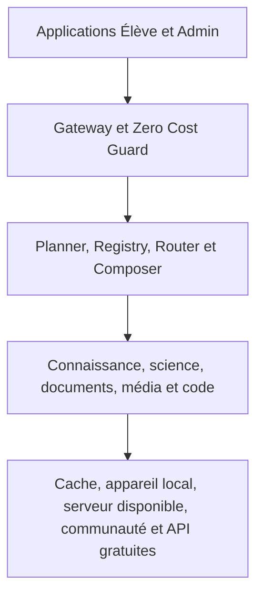
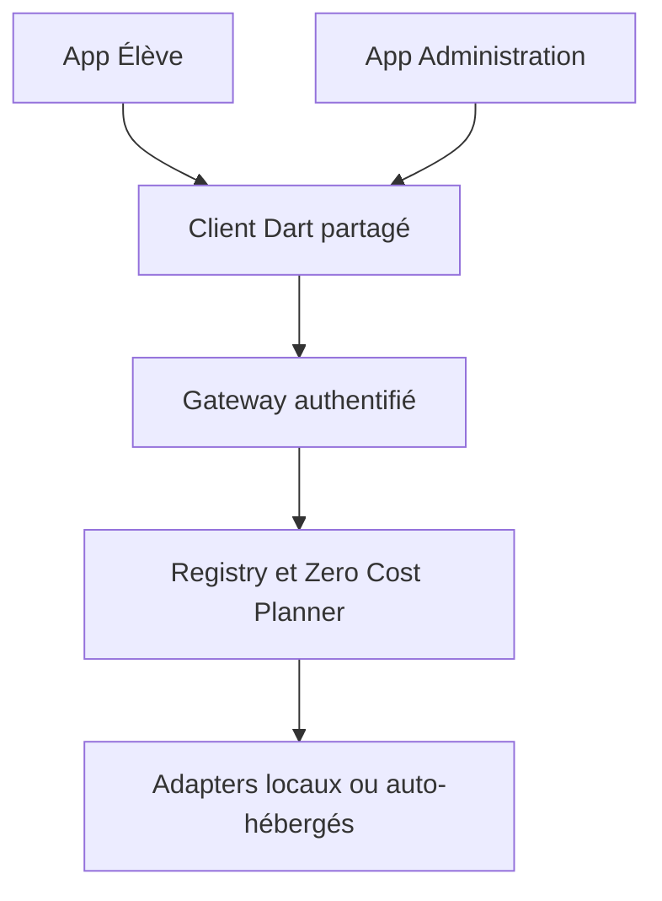

# PQ AI Fabric - Cahier des charges technique v4

## Zero-Cost Absolute - Infrastructure d'intelligence, d'outillage et d'orchestration de pq learn

**Version :** 4.0  
**Date :** 19 septembre 2026  
**Statut :** spécification complète destinée à l'audit, au développement, aux tests et au déploiement  
**Applications concernées :** application Élève, application Administration et backend pq learn  
**Principe directeur :** augmenter les agents déjà présents, sans les reconstruire inutilement  
**Contrainte financière :** aucune dépense obligatoire, aucun fournisseur payant critique, aucune carte bancaire nécessaire

> **Définition de Zero-Cost Absolute.** Le logiciel, les modèles retenus, les dépendances critiques et les parcours essentiels doivent fonctionner sans paiement obligatoire. Le calcul physique n'est jamais sans ressource : il utilise un téléphone, un ordinateur, de l'électricité, du stockage ou une connexion déjà disponible. Le système doit donc déplacer, réduire, mutualiser, mettre en cache ou différer ce calcul sans jamais créer une facture obligatoire.

---

# 0. Décisions exécutives

Cette version remplace le principe vague de « privilégier le gratuit » par une politique vérifiable.

| Exigence | Décision obligatoire |
|---|---|
| Coût récurrent minimal | **0 EUR** |
| Carte bancaire nécessaire | **Non** |
| API payante critique | **Interdite** |
| Trial ou crédit temporaire critique | **Interdit** |
| Passage automatique au payant | **Interdit** |
| Fonctionnement sans fournisseurs externes | **Obligatoire pour le coeur éducatif** |
| Calcul lourd image/vidéo | **Best effort local, communautaire, pré-calculé ou différé** |
| Données sensibles d'élèves chez un tiers | **Interdit par défaut** |
| APK principal | **Léger, avec packs optionnels** |
| Mesure de la qualité | **Benchmarks et tests de régression obligatoires** |
| Licence inconnue | **Blocage automatique** |

Le produit doit rester utile si, le même jour, tous les free tiers distants deviennent indisponibles.

---

# 1. Vision

PQ AI Fabric n'est pas une troisième application et n'est pas un nouveau chatbot. C'est une plateforme interne de capacités partagée par les agents Élève et Administration déjà existants.



Une demande peut mobiliser plusieurs outils : OCR, classification scolaire, recherche dans le programme, moteur symbolique, vérification d'unités, simulation, graphique et composition pédagogique. Le LLM n'est qu'une capacité parmi les autres.

Le système doit rechercher le meilleur **plan de capacités**, et non le plus grand modèle ni le plus grand nombre d'appels.

---

# 2. Périmètre

## 2.1 Inclus

- orchestration des agents existants ;
- questions, explications, corrections et révisions ;
- RAG sur les programmes et contenus pq learn ;
- calcul scientifique exact ou numérique ;
- documents, OCR, formules, tableaux et graphiques ;
- images, audio, animations et simulations ;
- génération et exécution sécurisée de code ;
- fonctionnement offline et synchronisation différée ;
- mémoire pédagogique et adaptation au niveau de l'élève ;
- routage entre appareils, moteurs locaux et ressources gratuites ;
- contrôle du coût, des licences, de la confidentialité et de la qualité ;
- centre de contrôle administratif ;
- standards éducatifs d'import, d'export et d'analytique.

## 2.2 Non-objectifs

- entraîner depuis zéro un modèle fondation géant ;
- promettre des images ou vidéos génératives illimitées sans GPU disponible ;
- contourner les quotas ou conditions d'un fournisseur ;
- envoyer silencieusement les données d'un mineur vers des services externes ;
- installer toutes les technologies inventoriées ;
- remplacer les agents existants sans audit ;
- confondre logiciel libre, modèle open-weight, free tier et calcul gratuit.

---

# 3. Objectifs non négociables

1. Le coeur éducatif doit fonctionner sans appel payant.
2. Le système doit d'abord rechercher une ressource validée, un cache ou une solution déterministe.
3. Un calcul exact ne doit pas être confié uniquement à un LLM.
4. Toute réponse critique doit être vérifiée par une règle, un solveur, une source ou un second moteur lorsque cela est possible.
5. Les agents existants doivent être augmentés, non dupliqués.
6. Les fonctionnalités offline doivent être conçues dès le départ.
7. Les modèles lourds doivent être distribués sous forme de packs optionnels.
8. Les téléphones faibles doivent bénéficier d'un parcours utile sans modèle lourd.
9. Chaque dépendance doit avoir une licence, une provenance et un statut explicites.
10. Chaque fournisseur externe doit avoir un fallback et un disjoncteur.
11. Les données d'élèves doivent être minimisées, pseudonymisées et gardées localement autant que possible.
12. La qualité doit être mesurée sur le programme camerounais et sur les appareils réellement ciblés.
13. La complexité et le poids de maintenance doivent être considérés comme des coûts.
14. Aucune fonctionnalité ne peut être déclarée terminée sans test réel.

---

# 4. Définition opérationnelle du coût zéro

## 4.1 Catégories financières

Chaque ressource reçoit exactement une catégorie :

| Code | Catégorie | Utilisation dans le coeur gratuit |
|---|---|---|
| Z0 | FOSS et usage commercial compatible | Autorisée après vérification |
| Z1 | Logiciel auto-hébergeable gratuit | Autorisée si le matériel existe déjà |
| Z2 | Calcul local sur appareil possédé | Autorisée avec consentement et limites |
| Z3 | Ressource communautaire sans SLA | Optionnelle, jamais critique |
| Z4 | Free tier récurrent sans carte | Optionnel avec fallback |
| Z5 | Free tier avec carte ou risque de facturation | Interdit par défaut |
| Z6 | Academic-only ou non-commercial | Interdit pour le produit commercial, sauf module séparé validé |
| Z7 | Trial, crédit temporaire ou promotion | Interdit comme dépendance |
| Z8 | Payant | Désactivé dans Zero-Cost Absolute |
| Z9 | Licence ou coût inconnu | Bloqué jusqu'à revue |

## 4.2 Ce que « gratuit » n'autorise pas

- créer plusieurs comptes pour contourner un quota ;
- masquer l'identité de pq learn à un fournisseur ;
- automatiser l'usage d'un service qui l'interdit ;
- utiliser un modèle dont la licence ne couvre pas l'usage commercial ;
- considérer une offre limitée dans le temps comme infrastructure permanente ;
- activer une facturation « au cas où » ;
- stocker des secrets de paiement dans le système.

## 4.3 Budget technique

Le budget monétaire du coeur est fixé à :

```text
mandatory_monthly_cost = 0 EUR
mandatory_paid_api_calls = 0
mandatory_credit_card = false
automatic_paid_fallback = false
```

Le système suit malgré tout CPU, RAM, GPU, batterie, données mobiles, stockage et temps de calcul. Économiser ces ressources fait partie du Zero-Cost.

---

# 5. Échelle d'exécution Zero-Cost

Avant chaque opération coûteuse, le Router suit cet ordre :

1. **Exact cache** : réponse identique déjà validée.
2. **Semantic cache** : ressource équivalente et compatible avec le contexte.
3. **Bibliothèque pédagogique** : illustration, explication, simulation ou correction validée.
4. **Génération déterministe** : SVG, formule, graphique, moteur scientifique, template.
5. **Calcul local léger** : règles, FTS, embeddings, moteur scientifique.
6. **IA locale** : modèle téléchargé si l'appareil est compatible.
7. **Serveur déjà disponible** : ordinateur de l'administrateur ou infrastructure existante.
8. **Community compute opt-in** : noeud volontaire sécurisé, sans donnée personnelle brute.
9. **Free tier légitime** : seulement s'il est disponible et autorisé.
10. **File d'attente ou dégradation** : aucun basculement payant.

Le résultat final doit indiquer au système, sans forcément l'afficher à l'élève : origine, moteurs utilisés, version, coût monétaire, temps, confiance et vérifications effectuées.

---

# 6. Architecture logique

## 6.1 PQ AI Gateway

Point d'entrée commun aux agents existants. Il assure authentification, autorisation, validation des entrées, limitation de débit, traçage, récupération du contexte et normalisation des réponses.

## 6.2 PQ Zero Cost Guard

Composant bloquant placé avant toute exécution. Il doit :

- calculer le coût monétaire maximal d'un plan ;
- refuser tout plan supérieur à 0 EUR en mode strict ;
- bloquer les providers Z5 à Z9 ;
- vérifier qu'aucune clé de facturation n'est nécessaire ;
- empêcher un fallback payant configuré par erreur ;
- imposer un plafond de tokens, de temps, de RAM, de batterie et de réseau ;
- journaliser la raison de chaque autorisation ou refus ;
- proposer un plan gratuit alternatif ;
- fonctionner même si le LLM ou le Router est compromis.

Le Guard repose sur des règles déterministes. Un LLM ne peut pas modifier seul la politique financière.

## 6.3 PQ Capability Planner

Transforme une demande en graphe de tâches typé. Il identifie : intention, matière, classe, chapitre, modalités, précision requise, données nécessaires, contraintes offline, risques, niveau de l'élève et critères de réussite.

## 6.4 PQ Technology Registry

Catalogue machine-readable de tous les outils, modèles, providers, datasets et formats. Le Registry peut contenir plusieurs centaines de candidats, sans que ceux-ci soient installés.

## 6.5 PQ Smart Router

Choisit un moteur selon : capacité, qualité mesurée, licence, coût nul, appareil, réseau, confidentialité, quota, latence, cache, historique d'échec et impact énergétique.

## 6.6 PQ Capability Composer

Exécute les graphes de tâches : séquence, parallélisme, branches, retries, timeouts, compensation, transformation de formats, consensus, vérification et fusion finale.

## 6.7 PQ Durable Workflow Engine

Les travaux longs doivent survivre aux interruptions. Candidats à comparer : Temporal et Dapr Workflow. Pour un premier déploiement simple, ARQ, Dramatiq ou Celery avec Valkey peuvent suffire. Le choix final dépend de l'audit et du benchmark opérationnel.

## 6.8 PQ Verification Layer

Vérifie calculs, unités, schémas, syntaxe, code, citations, contraintes et provenance. Elle sépare explicitement : résultat calculé, contenu retrouvé, contenu inféré et contenu généré.

## 6.9 PQ Policy Engine

Centralise les règles de coût, rôle, confidentialité, licence et capacité. Open Policy Agent est candidat pour les politiques côté serveur ; des règles compilées/locales sont nécessaires sur mobile.

## 6.10 PQ Pedagogical Memory

Représente la progression, les notions maîtrisées, erreurs récurrentes, prérequis manquants, difficulté, langue, préférences d'explication et révisions. Ce n'est pas un simple historique de chat.

## 6.11 PQ Knowledge Engine

Ingestion, indexation, recherche hybride, reranking, assemblage de contexte, citations et contrôle des permissions sur les programmes, cours, exercices, corrigés et ressources validées.

## 6.12 PQ Compute Broker

Inventorie les ressources locales et volontaires, réserve les capacités, applique les quotas et choisit le lieu d'exécution sans transmettre inutilement les données.

## 6.13 PQ Offline Engine

Gère packs, téléchargements différentiels, compatibilité appareil, reprise de téléchargement, signatures, stockage local, mises à jour et suppression.

## 6.14 PQ AI Fabric Control Center

Interface Admin pour Registry, providers, modèles, licences, coûts évités, quotas, workflows, workers, cache, benchmarks, erreurs, packs offline et politiques.

---

# 7. Schéma obligatoire du Technology Registry

Chaque entrée doit contenir au minimum :

```yaml
id: string
name: string
kind: library | model | provider | dataset | runtime | application
version: string
capabilities: []
platforms: []
languages: []
license:
  spdx_expression: string
  source_url: string
  commercial_use: true | false | unknown
  redistribution: true | false | unknown
  attribution_required: true | false
cost:
  class: Z0 | Z1 | Z2 | Z3 | Z4 | Z5 | Z6 | Z7 | Z8 | Z9
  requires_card: false
  auto_billing_possible: false
  mandatory_cost_eur: 0
runtime:
  local: true | false
  offline: true | false
  cpu: true | false
  gpu: true | false
  npu: true | false
  wasm: true | false
  webgpu: true | false
  min_ram_mb: integer
  min_storage_mb: integer
privacy:
  sends_data_external: true | false
  pii_allowed: false
quality:
  benchmark_version: string
  score: number
  confidence: number
operations:
  timeout_ms: integer
  fallback_ids: []
  status: ADOPT | TEST | RESERVE | REJECT
```

Une famille de modèles ne suffit pas : chaque checkpoint, quantification et licence doit avoir sa propre entrée.

---

# 8. Stack de référence minimale

Cette table définit des candidats initiaux, pas une obligation d'installer tous les outils.

| Couche | Choix principal initial | Fallback ou candidat de test |
|---|---|---|
| UI mobile/web | Flutter, Dart | PWA web |
| API | FastAPI, Pydantic, OpenAPI | gRPC/Protobuf pour workers |
| Base serveur | PostgreSQL/Supabase existant | PostgreSQL auto-hébergé |
| Base locale | SQLite, Drift, FTS5 | DuckDB pour analytique |
| Vecteurs | pgvector | Qdrant ou LanceDB si benchmark supérieur |
| Gateway modèles | LiteLLM auto-hébergé | adaptateurs natifs PQ |
| LLM local | llama.cpp ou MLC LLM | LiteRT-LM, ExecuTorch, ONNX Runtime |
| RAG | FTS5/BM25 + pgvector + reranker local | FAISS/Qdrant selon volume |
| Cache | SQLite local + Valkey serveur | cache sémantique PQ |
| Jobs | ARQ/Dramatiq/Celery | Temporal ou Dapr pour workflows complexes |
| Documents | Docling | PaddleOCR, Tesseract, OCRmyPDF |
| Audio | sherpa-onnx | whisper.cpp + Piper |
| Mathématiques | SymPy, NumPy, SciPy | SageMath, Maxima, Giac |
| Graphiques | ECharts/Flutter CustomPainter | Matplotlib, Plotly, Vega-Lite |
| Code web | Pyodide/JupyterLite | Wasmtime/WASI |
| Sandbox serveur | gVisor | Firecracker en phase avancée |
| Observabilité | OpenTelemetry | Prometheus, Grafana, Loki, Tempo |
| Évaluation | MLflow + tests PQ | Ragas, promptfoo, garak |
| Politiques | règles PQ + OPA | CEL selon contexte |
| SBOM/licences | CycloneDX/SPDX | ScanCode, ORT, Syft/Grype |

---

# 9. Profils d'appareils et packs

## 9.1 Device Tier L0 - très faible

- cours, exercices et corrigés ;
- SQLite FTS5 ;
- calculs déterministes légers ;
- SVG et graphiques simples ;
- aucun modèle lourd ;
- recours au cache ou au serveur gratuit disponible.

## 9.2 Device Tier L1 - faible

- embeddings compacts ;
- OCR léger ;
- STT/TTS compact optionnel ;
- petit classifieur ;
- pas de diffusion d'image locale.

## 9.3 Device Tier L2 - moyen

- petit LLM quantifié ;
- RAG local partiel ;
- vision et audio offline ;
- graphiques et simulations interactives.

## 9.4 Device Tier L3 - puissant

- LLM local plus capable ;
- génération d'image locale compacte si testée ;
- multimodal local ;
- contribution communautaire explicite possible.

## 9.5 Packs séparés

- `pq-core` : cours, FTS, moteurs scientifiques essentiels ;
- `pq-voice-fr`, `pq-voice-en`, `pq-voice-it` ;
- `pq-embeddings` ;
- `pq-llm-small` ;
- `pq-vision` ;
- `pq-science-advanced` ;
- `pq-media-creator` ;
- packs scolaires par classe et matière.

Chaque pack doit être signé, versionné, compressé, reprenable, désinstallable et accompagné de sa licence.

---

# 10. Intelligence conversationnelle et modèles

## 10.1 Rôle du LLM

Le LLM assure principalement compréhension linguistique, planification assistée, explication, reformulation et composition pédagogique. Il ne remplace pas les solveurs, bases de données, règles ou moteurs de rendu.

## 10.2 Runtimes à inventorier

- llama.cpp et format GGUF ;
- MLC LLM pour Android, iOS, WebGPU et WASM ;
- LiteRT/LiteRT-LM ;
- ExecuTorch ;
- ONNX Runtime Mobile et Web ;
- WebLLM ;
- Transformers.js ;
- vLLM pour un serveur GPU déjà disponible ;
- Ollama uniquement comme outil local d'administration ou de développement ;
- OpenVINO pour matériel compatible.

Le benchmark doit mesurer démarrage, tokens/seconde, mémoire, batterie, chauffe, exactitude, tool calling et stabilité.

## 10.3 Providers externes

Gemini, Groq, Mistral, Cloudflare Workers AI, OpenRouter, Hugging Face Providers et autres offres gratuites peuvent être enregistrés en Z4 seulement si :

- aucune carte n'est exigée ;
- aucune facturation automatique n'est possible ;
- l'usage prévu respecte les conditions ;
- les quotas sont interrogés ou configurés ;
- une perte totale du provider est testée ;
- aucune donnée sensible brute n'est envoyée ;
- le système reste fonctionnel sans eux.

## 10.4 Structured outputs

Les plans, appels d'outils et résultats intermédiaires utilisent JSON Schema/Pydantic. Toute sortie structurée est validée avant exécution. Les erreurs de schéma déclenchent réparation limitée ou fallback, jamais exécution aveugle.

---

# 11. Knowledge Engine et RAG

## 11.1 Corpus

- programmes officiels camerounais ;
- arbre académique de pq learn ;
- cours, chapitres et leçons ;
- objectifs, compétences et prérequis ;
- exercices, corrigés et barèmes ;
- examens et épreuves ;
- ressources validées par l'administration ;
- métadonnées de classe, série, matière, module et unité d'apprentissage.

## 11.2 Pipeline

```text
ingestion -> nettoyage -> découpage sémantique -> métadonnées
-> index lexical + index vectoriel -> retrieval hybride
-> filtrage par permissions -> reranking -> contexte
-> génération -> vérification -> citations
```

## 11.3 Outils

- SQLite FTS5 et BM25 pour l'offline ;
- PostgreSQL + pgvector puisque Supabase est déjà présent ;
- FAISS pour certains packs locaux ;
- Qdrant, LanceDB ou Chroma uniquement après benchmark ;
- Tantivy, Lucene, Meilisearch ou Typesense pour des recherches spécialisées ;
- SentenceTransformers, FastEmbed, Transformers.js ou modèles ONNX pour embeddings locaux ;
- RDFLib, Oxigraph, Apache Jena, RDF/SPARQL et SHACL pour le graphe de connaissances si nécessaire.

## 11.4 Règles

- aucune réponse ne doit inventer un élément du programme ;
- chaque segment doit garder sa source, sa version et ses permissions ;
- les index doivent être reproductibles ;
- les embeddings de modèles différents ne doivent pas être mélangés ;
- la recherche hybride doit être comparée à lexical-only et vector-only ;
- le contenu produit par l'IA n'entre pas dans le corpus validé sans revue.

---

# 12. Mémoire pédagogique et apprentissage adaptatif

## 12.1 Learner Model

Le modèle de l'élève représente : classe, série, matières, objectifs, notions vues, maîtrise estimée, erreurs, temps de réponse, indices utilisés, difficulté, langue, révisions et consentements.

## 12.2 Capacités

- mastery estimation ;
- Bayesian Knowledge Tracing et alternatives ;
- FSRS pour répétition espacée ;
- Item Response Theory ;
- Computerized Adaptive Testing ;
- détection de prérequis manquants ;
- recommandations ciblées ;
- génération d'exercices gradués ;
- explications alternatives après échec ;
- tableaux de bord agrégés pour les enseignants.

## 12.3 Outils candidats

FSRS, pyBKT, bibliothèques IRT/CAT en Python ou R, OR-Tools pour planification, modèles statistiques classiques et règles pédagogiques explicables.

Les décisions importantes ne doivent pas dépendre uniquement d'un score opaque. L'élève et l'enseignant doivent pouvoir comprendre pourquoi une révision est proposée.

---

# 13. Moteurs scientifiques

## 13.1 Mathématiques

- SymPy, mpmath, NumPy, SciPy ;
- SageMath, Maxima, Giac/Xcas ;
- MathLive/Cortex Compute Engine ;
- GeoGebra et JSXGraph ;
- Matplotlib, Plotly, ECharts, D3, Vega-Lite ;
- R/ggplot2 et Julia ;
- Octave et Scilab ;
- Pint, Astropy Units ou unyt pour unités et dimensions ;
- Lean 4, Coq, Isabelle, Z3 ou cvc5 en TEST/RESERVE pour preuves et contraintes.

## 13.2 Statistiques et optimisation

- pandas ou Polars, statsmodels, scikit-learn ;
- R et Julia pour analyses spécialisées ;
- OR-Tools, HiGHS, COIN-OR, Ipopt, OSQP et GLPK ;
- PyMC ou alternatives uniquement pour modules avancés ;
- DuckDB et Parquet pour analytique locale.

## 13.3 Physique et ingénierie

- SymPy Mechanics, SciPy ODE/PDE, python-control ;
- ngspice, Qucs-S, Xyce ou SpiceOpus selon licence ;
- OpenModelica ;
- Open Source Physics ;
- moteurs ray-optics ;
- CoolProp pour thermodynamique si pertinent ;
- GNU Radio pour signaux et communications ;
- OpenFOAM, FEniCS, Elmer et CalculiX en RESERVE ;
- ROS 2, Gazebo et Webots en RESERVE pour robotique ;
- ns-3 et Mininet en RESERVE pour réseaux.

## 13.4 Chimie

RDKit, Open Babel, Cantera, Avogadro, Jmol/JSmol, Ketcher, données PubChem selon conditions, ASE et outils quantiques seulement pour extensions avancées.

## 13.5 Biologie

Biopython, scikit-bio, visualisation moléculaire, outils de séquences et bases ouvertes dont la licence et les conditions d'usage sont vérifiées.

## 13.6 Terre, géographie et climat

QGIS, GDAL, PROJ, Rasterio, xarray, MapLibre, Leaflet, CesiumJS, deck.gl, GeoJSON et OpenStreetMap. Les serveurs de tuiles publics ne sont pas considérés comme une infrastructure gratuite illimitée ; prévoir cache, packs offline ou hébergement autorisé.

## 13.7 Astronomie

Astropy, Skyfield, Stellarium et Celestia selon les modalités d'intégration.

---

# 14. Document Intelligence et OCR

## 14.1 Pipeline

```text
photo/PDF/document -> validation -> antivirus -> correction image
-> détection layout -> OCR -> tableaux/formules/images
-> structure -> classification scolaire -> indexation -> RAG
```

## 14.2 Outils principaux

- Docling comme candidat principal pour parsing multi-format et PDF ;
- PaddleOCR et Tesseract comme OCR complémentaires ;
- OCRmyPDF pour rendre les PDF recherchables ;
- PDF.js, PDFium ou PDFBox selon plateforme ;
- Pandoc, Typst, Quarto et LaTeX ;
- LibreOffice headless ;
- docx.js, PptxGenJS et bibliothèques tableur ;
- Apache Tika ou Unstructured en fallback d'ingestion ;
- Surya, Marker, MinerU, TrOCR et pix2tex en TEST pour layout, manuscrit et math OCR.

## 14.3 Règles

- conserver le fichier original et sa somme de contrôle ;
- ne jamais considérer l'OCR comme vérité certaine ;
- relier chaque bloc extrait à sa page et sa boîte englobante ;
- signaler les formules incertaines ;
- permettre la correction humaine avant publication ;
- traiter les fichiers malveillants dans un environnement isolé.

---

# 15. Images, vision, vidéo et rendu

## 15.1 Hiérarchie pédagogique

1. réutiliser un asset validé ;
2. générer un SVG ou graphique exact ;
3. produire une animation/simulation déterministe ;
4. utiliser vision ou génération d'image locale ;
5. utiliser un noeud GPU volontaire ;
6. utiliser un free tier autorisé ;
7. mettre en attente si aucune ressource gratuite n'existe.

## 15.2 Vision

OpenCV, MediaPipe, ONNX Runtime, modèles de détection/segmentation validés, OCR spécialisé et modèles multimodaux compacts.

## 15.3 Images génératives

Diffusers et ComfyUI servent d'orchestrateurs locaux. Les familles FLUX, Stable Diffusion/SDXL, Qwen Image et futures familles sont des **candidats**, jamais une approbation globale. Chaque checkpoint doit passer : licence, commercial-use, poids, qualité éducative, sécurité, biais, RAM/VRAM et benchmark.

La génération lourde doit fonctionner en lot, en basse priorité, avec cache et déduplication. Une même demande normalisée ne doit pas être recalculée pour plusieurs élèves.

## 15.4 Vidéo

- priorité à Manim, FFmpeg, SVG animé, Canvas, WebGL/WebGPU, Three.js, Babylon.js, Godot et simulations interactives ;
- Wan, LTX Video, HunyuanVideo, CogVideoX et autres modèles restent en RESERVE/TEST ;
- aucune promesse de vidéo générative instantanée ou illimitée ;
- pré-génération Admin, file d'attente et réutilisation obligatoires.

## 15.5 Pipeline média

FFmpeg, libvips, ImageMagick, OpenColorIO si nécessaire, codecs libres compatibles, génération de miniatures, transcodage adaptatif et suppression des métadonnées sensibles.

## 15.6 Provenance

Chaque asset garde prompt, modèle, version, seed si applicable, licence, auteur humain, date, vérifications, hash et liens vers les sources. C2PA peut être évalué pour les médias générés.

---

# 16. Audio, parole et langues

## 16.1 Stack

- sherpa-onnx pour STT, TTS, VAD, identification de langue et fonctions audio locales ;
- whisper.cpp pour transcription offline ;
- Piper pour TTS local selon modèles et licences ;
- Silero VAD ;
- Web Audio API et Tone.js ;
- librosa, SciPy.signal, Essentia et aubio ;
- FluidSynth, Verovio et MuseScore pour musique et notation.

## 16.2 Langues

Français, anglais et italien sont prioritaires. Argos Translate, Marian, Bergamot, NLLB ou autres modèles peuvent être évalués pour traduction locale. Les accents camerounais et environnements bruyants doivent figurer dans le benchmark audio.

## 16.3 Accessibilité

Sous-titres WebVTT, réglage de vitesse, transcription, navigation clavier, contraste, textes alternatifs, modes dyslexie si validés, compatibilité lecteur d'écran et équivalents textuels pour les médias.

---

# 17. Code Lab sécurisé

## 17.1 Niveaux d'exécution

1. Pyodide/JupyterLite dans le navigateur pour Python compatible ;
2. WebAssembly/WASI avec Wasmtime pour tâches isolables ;
3. Judge0 ou Piston auto-hébergé après revue ;
4. conteneurs gVisor pour langages natifs ;
5. Firecracker en phase avancée si l'isolation multi-tenant l'exige.

## 17.2 Outils

Monaco ou CodeMirror, Tree-sitter, Language Server Protocol, compilateurs libres, tests unitaires, limites CPU/RAM/temps/processus/fichiers et réseau désactivé par défaut.

## 17.3 Langages

Python, C, C++, C#, Java, JavaScript/TypeScript, Kotlin, Rust, Go, Fortran, PHP, Ruby et autres uniquement lorsque le sandbox les supporte.

## 17.4 Sécurité

- système de fichiers éphémère ;
- aucune clé secrète visible ;
- réseau bloqué sauf allowlist ;
- image de runtime immuable ;
- limites strictes ;
- suppression après exécution ;
- journal technique sans code privé inutile ;
- analyse de malware et interdiction des exécutables téléchargés non validés.

---

# 18. Design et visualisation

## 18.1 Rendu Flutter

CustomPainter, SVG, Canvas, shaders validés et composants responsives. Les frameworks CSS ne concernent que les écrans Web et ne doivent pas alourdir l'application Flutter native.

## 18.2 Dataviz

Apache ECharts, D3, Plotly, Vega/Vega-Lite, Observable Plot, Matplotlib et ggplot2.

## 18.3 Diagrammes et whiteboards

Mermaid, Graphviz, PlantUML, D2, Cytoscape.js, TikZ, Excalidraw, Fabric.js, Konva, Paper.js, Rough.js, SVG.js et p5.js.

## 18.4 3D et simulation

Three.js, Babylon.js, VTK/vtk.js, Open3D, OpenCascade/FreeCAD, Blender, Godot, Flame, Box2D et Rapier.

## 18.5 Design Engine

Le moteur applique automatiquement hiérarchie, typographie, espacements, couleurs, responsive, impression, accessibilité et cohérence de marque. Il vérifie débordements, contrastes, lisibilité mobile et densité d'information.

---

# 19. Données, cache, stockage et synchronisation

## 19.1 Stockage

- PostgreSQL/Supabase pour données serveur existantes ;
- SQLite/Drift pour appareils ;
- pgvector pour embeddings serveur ;
- DuckDB, Polars, Arrow et Parquet pour analytique ;
- stockage objet S3-compatible ou MinIO seulement si une machine existe déjà ;
- export chiffré local comme sauvegarde gratuite.

## 19.2 Cache multi-niveaux

- cache mémoire ;
- cache SQLite appareil ;
- Valkey serveur ;
- cache exact ;
- cache sémantique ;
- cache d'assets ;
- cache de compilation/modèle ;
- invalidation par version de contenu, modèle et politique.

## 19.3 Offline et CRDT

Drift/SQLite pour données locales ; Automerge ou Yjs pour collaboration et fusion lorsque nécessaire. Les conflits pédagogiques sensibles restent soumis à une règle métier ou une revue humaine.

## 19.4 Déduplication

Les contenus, prompts normalisés et assets utilisent des hashes. Le système évite le double stockage et le double calcul sans confondre deux contextes pédagogiques différents.

---

# 20. Orchestration, files et résilience

## 20.1 Exigences

- idempotence ;
- retries bornés avec backoff ;
- timeouts ;
- annulation ;
- priorité Admin/Élève ;
- quotas par capacité ;
- dead-letter queue ;
- reprise après crash ;
- compensation des workflows ;
- stockage de l'état minimal ;
- aucun job infini.

## 20.2 Candidats

Valkey/Redis, NATS, ARQ, Dramatiq, Celery, Temporal et Dapr. Un seul chemin principal doit être adopté après audit. Kafka, Kubernetes, Ray, KServe ou infrastructures plus lourdes restent en RESERVE tant que l'échelle ne les justifie pas.

## 20.3 Dégradation

La perte d'un worker, d'un provider, d'Internet ou d'un modèle ne doit pas bloquer l'application. Le système répond avec une capacité réduite, met en attente ou explique honnêtement la limite.

---

# 21. Sécurité, confidentialité et protection des mineurs

## 21.1 Principes

- local-first pour données sensibles ;
- minimisation et finalité explicite ;
- pseudonymisation ;
- consentement et contrôle par rôle ;
- export, correction et suppression ;
- chiffrement en transit et au repos lorsque applicable ;
- séparation des environnements ;
- rotation des secrets ;
- audit logs sans contenu inutile ;
- rétention limitée.

## 21.2 Outils candidats

OPA pour politique, Presidio pour PII, ClamAV/YARA pour fichiers, Trivy/Grype pour vulnérabilités, gVisor/Wasmtime pour isolation, SOPS + age ou OpenBao pour secrets selon infrastructure.

## 21.3 Prompt injection et RAG

- considérer les documents comme données non fiables ;
- ne jamais exécuter une instruction trouvée dans un document ;
- séparer contenu, commande et politique ;
- allowlist des outils par rôle ;
- confirmer les actions sensibles ;
- tester les injections avec jeux adversariaux ;
- ne jamais exposer prompts système, clés ou données d'autres utilisateurs.

## 21.4 Community compute

Les workers ne reçoivent pas identité, coordonnées, historique complet ni fichier brut d'un élève. Les tâches sont minimisées, chiffrées lorsque possible, isolées et supprimées après expiration.

---

# 22. Licences et chaîne d'approvisionnement

## 22.1 Distinctions obligatoires

- logiciel open source ;
- modèle open-weight ;
- données ouvertes ;
- service gratuit ;
- contenu libre ;
- usage académique seulement.

Ces catégories ne sont jamais interchangeables.

## 22.2 Registre de licence

Pour chaque artefact : SPDX, URL officielle, texte/empreinte de licence, commercial-use, redistribution, dérivés, attribution, restrictions de données, date de revue et responsable.

## 22.3 Outils

CycloneDX ou SPDX pour SBOM, ScanCode Toolkit ou OSS Review Toolkit pour licences, Syft/Grype ou Trivy pour composants et vulnérabilités, Sigstore/Cosign pour signatures, safetensors pour modèles lorsque disponible, ModelScan/picklescan pour fichiers de modèles risqués.

## 22.4 Blocage

Une licence inconnue, incohérente ou incompatible force `status: REJECT` ou `status: TEST` isolé. Aucun agent ne peut approuver seul une licence.

---

# 23. Standards éducatifs et portabilité

## 23.1 Standards prioritaires

- QTI 3 pour questions, tests, scoring et résultats ;
- LTI 1.3 pour intégration future avec LMS ;
- Caliper Analytics ou xAPI pour événements pédagogiques ;
- H5P pour contenus interactifs ;
- Common Cartridge pour échanges de contenus ;
- WCAG 2.2 et bonnes pratiques WAI-ARIA pour accessibilité ;
- WebVTT pour sous-titres.

## 23.2 Politique

Le modèle interne de pq learn reste plus riche que les standards, mais chaque objet important possède une stratégie d'import/export. La certification payante éventuelle n'est pas une dépendance du fonctionnement gratuit.

---

# 24. Observabilité et évaluation

## 24.1 Télémétrie

OpenTelemetry pour traces, métriques et logs ; Prometheus pour métriques ; Grafana pour dashboards ; Loki/Tempo ou alternatives compatibles. Les données pédagogiques sensibles ne doivent pas être copiées dans les traces.

## 24.2 Évaluation IA

MLflow pour datasets, expériences, versions et feedback ; Ragas pour RAG et tool calling ; promptfoo, garak ou outils équivalents pour tests fonctionnels et adversariaux.

## 24.3 Métriques

- exactitude et conformité au programme ;
- réussite du retrieval et du reranking ;
- fidélité au contexte et citations ;
- exactitude des appels d'outils ;
- calculs et unités ;
- qualité pédagogique ;
- progression réelle de l'élève ;
- latence P50/P95/P99 ;
- RAM, CPU, GPU, batterie, réseau et stockage ;
- taux de cache ;
- taux de fallback ;
- indisponibilité provider ;
- coût monétaire observé et coût évité ;
- incidents de sécurité et licence.

## 24.4 Benchmark PQ

Au moins 1 000 scénarios versionnés, avec extension progressive : mathématiques, physique, chimie, informatique, langues, histoire-géographie, biologie, documents, images, audio, administration, offline, sécurité et coût zéro.

Comparer systématiquement :

```text
LLM seul
LLM + RAG
LLM + outil déterministe
LLM + plusieurs outils
outils + vérification
local vs serveur disponible vs free tier
```

---

# 25. Community Compute

## 25.1 Principe

Des ordinateurs volontaires peuvent exécuter des tâches anonymisées : pré-calcul d'illustrations, embeddings publics, génération média non sensible, benchmarks ou simulations.

## 25.2 Conditions

- consentement explicite ;
- pause immédiate ;
- limites CPU/GPU, batterie, température, horaires et réseau ;
- priorité à l'utilisateur de la machine ;
- sandbox ;
- tâches signées ;
- résultat vérifié ;
- aucune promesse de disponibilité ;
- aucune donnée privée brute ;
- réputation et révocation des workers.

## 25.3 Statut

Community Compute est `RESERVE` jusqu'à validation du coeur local, de la sécurité et de l'observabilité. BOINC, libp2p, WebRTC, Bacalhau et technologies apparentées peuvent être étudiés, mais aucun n'est adopté automatiquement.

---

# 26. Modes de fonctionnement et dégradation

| Mode | Connectivité | Capacités garanties |
|---|---|---|
| Offline Basic | Aucune | cours, exercices, recherche locale, calculs, graphiques légers |
| Offline AI | Aucune | plus embeddings, voix, OCR, petit LLM selon appareil |
| Connected Free | Réseau | cache partagé, serveur disponible, free tiers optionnels |
| Community | Réseau | tâches lourdes anonymisées si workers disponibles |
| Admin Batch | Différé | génération de contenus et médias en lot |

Si une capacité lourde manque, le système peut : réutiliser un asset, produire un schéma, réduire la résolution, différer, proposer une simulation ou annoncer honnêtement l'indisponibilité. Il ne doit jamais basculer silencieusement vers une facture.

---

# 27. Présentation dans les applications

## 27.1 Application Élève

- Demander à PQ ;
- Expliquer autrement ;
- Résoudre et vérifier ;
- Photographier une question ;
- Importer un document ;
- Tracer, simuler et manipuler ;
- Écouter et dicter ;
- Exécuter du code ;
- Réviser selon le Learner Model ;
- gérer les packs offline ;
- afficher clairement une file d'attente ou un mode réduit.

Le détail technique des providers reste caché, mais la provenance pédagogique et les citations doivent être accessibles.

## 27.2 Application Administration

PQ AI Fabric Control Center doit inclure :

- Technology Registry ;
- Zero Cost Guard ;
- modèles et packs ;
- providers et quotas ;
- licences/SBOM ;
- Planner/Router/Composer ;
- workflows, queues et workers ;
- cache et déduplication ;
- RAG et corpus ;
- benchmarks et régressions ;
- observabilité ;
- sécurité et incidents ;
- community compute ;
- coûts observés, coûts évités et preuve de facture nulle.

## 27.3 Notifications et diffusion

Web Push, notifications internes et mécanismes gratuits sont prioritaires. SMS et automatisation WhatsApp ne peuvent pas être des dépendances Zero-Cost ; prévoir partage manuel, deep links et modules optionnels désactivés.

## 27.4 Distribution

PWA et APK direct permettent une distribution sans boutique payante. Toute boutique, signature commerciale, domaine ou canal demandant un paiement reste optionnel et extérieur au coeur Zero-Cost.

---

# 28. Contrats API essentiels

## 28.1 Requête de capacité

```json
{
  "request_id": "uuid",
  "actor": {"role": "student", "class": "Premiere C"},
  "intent": "solve_and_visualize",
  "modalities": ["text", "image"],
  "constraints": {
    "mandatory_cost_eur": 0,
    "offline_preferred": true,
    "external_pii_allowed": false
  }
}
```

## 28.2 Plan

```json
{
  "tasks": [
    {"id": "ocr", "capability": "document.ocr"},
    {"id": "solve", "capability": "math.symbolic", "depends_on": ["ocr"]},
    {"id": "verify", "capability": "math.verify", "depends_on": ["solve"]},
    {"id": "render", "capability": "visual.plot", "depends_on": ["verify"]}
  ],
  "max_monetary_cost_eur": 0
}
```

## 28.3 Résultat

```json
{
  "status": "completed",
  "artifacts": [],
  "provenance": [],
  "verification": {"status": "passed", "confidence": 0.96},
  "cost": {"monetary_eur": 0, "cpu_ms": 0, "network_bytes": 0}
}
```

---

# 29. Structure logicielle indicative

```text
backend/
  pq_ai_fabric/
    gateway/
    zero_cost_guard/
    planner/
    registry/
    router/
    composer/
    workflows/
    verification/
    policy/
    pedagogy/
    memory/
    knowledge/
    scientific/
      mathematics/
      physics/
      chemistry/
      biology/
      geography/
      engineering/
    media/
      image/
      video/
      audio/
      vision/
    documents/
    code_lab/
    design/
    offline/
    providers/
    compute/
    community/
    cache/
    quotas/
    observability/
    security/
    licensing/
    benchmarks/
    standards/
```

Cette arborescence est indicative. L'audit du repository réel décide des chemins finaux.

---

# 30. Roadmap d'implémentation

## Phase P0 - Audit et protection de l'existant

- cartographier applications, backend, Supabase et agents ;
- exécuter les tests existants ;
- identifier doublons, dettes et contraintes ;
- établir une baseline de performance et de coût.

## Phase P1 - Zero Cost Foundation

- Technology Registry ;
- catégories Z0-Z9 ;
- Zero Cost Guard ;
- contrats de capacités ;
- feature flags ;
- premiers tests prouvant l'absence d'appel payant.

## Phase P2 - Gateway et Router

- abstraction providers ;
- LiteLLM ou adaptateurs PQ ;
- quotas, circuit breakers, fallback local ;
- structured outputs.

## Phase P3 - Planner, Composer et workflows

- graphes typés ;
- exécution multi-outils ;
- retries, timeouts, annulation ;
- files et reprise.

## Phase P4 - Verification Layer

- calculs, unités, citations, code, schémas ;
- score de confiance ;
- gestion explicite des divergences.

## Phase P5 - Knowledge/RAG

- corpus validé ;
- ingestion ;
- recherche hybride ;
- citations ;
- benchmark de retrieval.

## Phase P6 - Scientific Engine

- mathématiques, graphiques, unités ;
- physique et chimie prioritaires ;
- intégration progressive par matière.

## Phase P7 - Pedagogical Memory

- modèle de maîtrise ;
- prérequis ;
- FSRS ;
- remédiation et tests adaptatifs.

## Phase P8 - Offline Engine

- profils appareil ;
- packs ;
- synchronisation ;
- voix, embeddings et petit LLM optionnels.

## Phase P9 - Documents, média, code et design

- OCR/document ;
- audio ;
- images déterministes ;
- Code Lab ;
- génération lourde uniquement après garde-fous.

## Phase P10 - Standards et Control Center

- QTI, Caliper/xAPI et exports ;
- dashboards ;
- licences, SBOM et observabilité.

## Phase P11 - Community Compute

- prototype non sensible ;
- sécurité ;
- benchmark ;
- déploiement seulement si bénéfice prouvé.

## Phase P12 - Scale

- optimisation selon mesures ;
- aucun ajout d'infrastructure avant besoin démontré ;
- maintien du coût obligatoire à 0 EUR.

---

# 31. Critères d'acceptation

## 31.1 Coût

- 100 % des tests du coeur terminent avec `monetary_eur = 0` ;
- aucun secret de paiement n'existe ;
- aucun provider Z5-Z9 n'est accessible en mode strict ;
- la disparition de tous les free tiers laisse Offline Basic fonctionnel ;
- aucun fallback payant n'est possible, même après erreur.

## 31.2 Fonctionnel

- les agents existants utilisent le Fabric sans régression ;
- le Planner produit un graphe structuré ;
- le Composer exécute plusieurs moteurs ;
- les résultats déterministes sont vérifiés ;
- le RAG cite les contenus ;
- le mode offline couvre les parcours essentiels ;
- les packs sont installables et supprimables.

## 31.3 Qualité

- benchmark PQ versionné et reproductible ;
- aucune régression P0 non résolue ;
- qualité mesurée par classe et matière ;
- latence et mémoire compatibles avec au moins un appareil faible de référence ;
- les réponses incertaines l'indiquent.

## 31.4 Sécurité

- tests d'isolation du Code Lab ;
- fichiers malveillants bloqués ;
- aucune donnée sensible dans les traces ;
- licences et hashes vérifiés ;
- prompt injection et exfiltration testées ;
- suppression et export des données vérifiés.

---

# 32. Matrice de décision provisoire

| Domaine | ADOPT initial | TEST | RESERVE | REJECT en Zero-Cost |
|---|---|---|---|---|
| RAG | FTS5, pgvector | Qdrant, LanceDB | graphe avancé | SaaS vectoriel payant |
| LLM local | llama.cpp | MLC, LiteRT, ExecuTorch, ONNX | vLLM GPU partagé | modèle/licence inconnus |
| Gateway | LiteLLM ou adaptateur PQ | MCP/A2A contrôlés | gateway enterprise | passerelle payante obligatoire |
| Documents | Docling, PaddleOCR, Tesseract | Surya, Marker, MinerU | VLM lourd | OCR payant critique |
| Audio | sherpa-onnx, whisper.cpp, Piper | modèles compacts alternatifs | génération audio lourde | TTS/STT payant critique |
| Images | SVG, graphes, Diffusers local | checkpoints validés | génération GPU communautaire | API image payante critique |
| Vidéo | FFmpeg, Manim, simulation | modèles locaux si GPU | community GPU | API vidéo payante critique |
| Code | Pyodide, Wasmtime | gVisor/Judge0 | Firecracker | exécution non isolée |
| Observabilité | OpenTelemetry | MLflow/Ragas stack | services gérés | télémétrie payante critique |
| Standards | QTI, Caliper/xAPI | LTI, H5P | certification | format fermé obligatoire |

Les statuts définitifs ne peuvent être attribués qu'après audit, revue de licence et benchmark.

---

# 33. Risques et réponses

| Risque | Réponse obligatoire |
|---|---|
| Free tier supprimé | fallback local et test de panne totale |
| Téléphone trop faible | Offline Basic sans modèle lourd |
| Pas de GPU | SVG, simulation, pré-calcul, file d'attente |
| APK trop volumineux | packs optionnels et téléchargement différentiel |
| Modèle sous licence incompatible | blocage Registry |
| Réponse fluide mais fausse | Verification Layer et confiance |
| Donnée élève exposée | local-first, redaction et politique |
| Trop d'outils | un primaire et un fallback par capacité |
| Community worker malveillant | tâches minimisées, sandbox et vérification |
| Maintenance excessive | critères d'adoption et retrait automatique |
| Coût caché | Zero Cost Guard, métriques et tests CI |
| Dépendance à un format | standards ouverts et export |

---

# 34. Sources techniques de référence

Les versions, licences et conditions doivent être revérifiées au moment de l'adoption.

- ExecuTorch : <https://docs.pytorch.org/executorch/stable/index.html>
- LiteRT : <https://developers.google.com/edge/litert>
- MLC LLM : <https://github.com/mlc-ai/mlc-llm>
- ONNX Runtime Mobile : <https://onnxruntime.ai/docs/get-started/with-mobile.html>
- LiteLLM : <https://docs.litellm.ai/docs/>
- Temporal : <https://docs.temporal.io/>
- Dapr Workflow : <https://docs.dapr.io/developing-applications/building-blocks/workflow/workflow-overview/>
- OpenTelemetry : <https://opentelemetry.io/docs/what-is-opentelemetry/>
- MLflow Evaluation : <https://mlflow.org/docs/latest/genai/eval-monitor/>
- Ragas : <https://docs.ragas.io/en/stable/>
- Open Policy Agent : <https://www.openpolicyagent.org/docs>
- gVisor : <https://gvisor.dev/docs/>
- Firecracker : <https://firecracker-microvm.github.io/>
- Wasmtime : <https://wasmtime.dev/>
- CycloneDX : <https://cyclonedx.org/>
- QTI : <https://www.1edtech.org/standards/qti>
- LTI : <https://www.1edtech.org/standards/lti>
- Caliper Analytics : <https://www.1edtech.org/standards/caliper>
- Supabase pgvector : <https://supabase.com/docs/guides/ai/vector-columns>
- DuckDB : <https://duckdb.org/why_duckdb>
- Automerge : <https://automerge.org/docs/hello/>
- sherpa-onnx : <https://github.com/k2-fsa/sherpa-onnx>
- Docling : <https://github.com/docling-project/docling>

---

# 35. Critère final de réussite

PQ AI Fabric v4 est réussi lorsque les agents existants peuvent comprendre une demande, la décomposer, retrouver les connaissances autorisées, composer plusieurs moteurs gratuits, vérifier les résultats, adapter l'explication à l'élève et produire une réponse multimodale de qualité, tout en restant utile sans Internet et sans aucun fournisseur externe.

Le succès n'est pas le nombre d'outils connectés. Le succès est la capacité à maintenir simultanément :

- **0 EUR de dépense obligatoire** ;
- **aucune dépendance payante critique** ;
- **qualité pédagogique mesurable** ;
- **fonctionnement offline réel** ;
- **sécurité et confidentialité des élèves** ;
- **résultats vérifiables** ;
- **architecture maintenable**.

**Règle ultime : tout ce qui est essentiel doit fonctionner gratuitement. Tout ce qui exige exceptionnellement une forte puissance de calcul doit être local, communautaire, pré-calculé, mis en cache, différé ou désactivable - jamais transformé en dépense obligatoire.**

---

# 36. Certification de l'écosystème GitHub

## 36.1 Réponse formelle

Oui : il existe suffisamment de projets GitHub sérieux pour couvrir la lecture et la génération de texte, documents, images, audio, musique et vidéo, ainsi que l'OCR, la recherche, le RAG, l'orchestration, les outils scientifiques, l'exécution de code, la sécurité et l'évaluation.

Non : « prendre absolument tous les GitHub » ne constitue ni une architecture ni une garantie de gratuité. GitHub contient des centaines de millions de dépôts, des forks, des projets abandonnés, des licences incompatibles, du code malveillant et des modèles dont la licence diffère de celle du code. PQ doit donc rendre **tout ajout possible**, mais n'activer que les composants passés par le Registry, le Zero Cost Guard, la revue de licence, le scan de sécurité et les benchmarks.

Au 2026-09-19, le catalogue machine-readable contient **30 capacités** et **97 candidats** : **54 approuvés**, **38 conditionnels**, **2 à surveiller** et **3 bloqués**. Cette certification porte sur la politique de sélection et les métadonnées vérifiées à cette date ; elle ne remplace pas une revue juridique lors de chaque mise à jour de code ou de poids.

## 36.2 Ce qu'est réellement un « outil GitHub »

| Objet | Rôle | Contrôle obligatoire |
|---|---|---|
| Dépôt de code | runtime, bibliothèque, application ou serveur | licence du code, activité, vulnérabilités, reproductibilité |
| Poids de modèle | capacité IA réelle | licence distincte, provenance, taille, langues, matériel |
| Agent | boucle de décision utilisant modèles et outils | permissions, budget, arrêt, observabilité |
| Skill | procédure réutilisable et contrainte | source, version, capacités autorisées |
| Serveur MCP | exposition standardisée d'outils | allowlist, authentification, schémas, sandbox |
| Adapter | contrat PQ vers un runtime | timeout, quotas, format, fallback, tests |
| Workflow | composition de plusieurs capacités | reprise, idempotence, traçage, compensation |

# 37. Implémentation ajoutée au projet pq learn

## 37.1 Principe

Les chats et agents existants restent en place. La nouvelle couche n'est pas un chatbot supplémentaire : elle leur fournit un catalogue partagé et un planificateur déterministe. L'application Élève et l'application Administration utilisent le même Gateway et le même client Dart, sans intégrer directement 97 SDK différents.



## 37.2 Fichiers et contrats

| Élément | Emplacement | Fonction |
|---|---|---|
| Catalogue JSON | `gateway/config/capability_catalog.json` | 30 capacités, 97 candidats, licences et contraintes |
| Modèles typés | `gateway/app/capabilities/models.py` | schéma Pydantic et invariants zéro coût |
| Registry/Planner | `gateway/app/capabilities/registry.py` | validation, filtrage, classement et dégradation |
| Routes partagées | `gateway/app/capabilities/routes.py` | inventaire et planification authentifiés |
| Validateur CI | `gateway/scripts/validate_capability_catalog.py` | échec si coût, carte, doublon ou capacité vide |
| Tests | `gateway/tests/test_capability_registry.py` | licences, GPU, offline, capacités inconnues |
| Client Flutter/Dart | `packages/pq_ai_fabric_client/` | contrat unique pour les deux applications |

API exposée :

- `GET /v1/capabilities` : inventaire compact ;
- `GET /v1/capabilities/{capability_id}` : détail et providers ;
- `POST /v1/capabilities/plan` : plan compatible avec cible, matériel, réseau, GPU et licence.

Le Planner n'exécute encore aucun binaire tiers : il décide d'abord si un provider est admissible. Les adapters d'exécution doivent être ajoutés par lots après test. Cette séparation empêche qu'un simple ajout au catalogue déclenche un téléchargement, une exécution ou une fuite de données.

## 37.3 Invariants exécutables

1. `mandatory_cost_eur` reste égal à zéro.
2. Les API payantes et cartes bancaires restent interdites.
3. Un provider bloqué ou en veille ne peut pas devenir `core`.
4. Un provider activé par défaut doit être approuvé.
5. Une licence conditionnelle exige un opt-in explicite.
6. Une demande sans GPU élimine les providers GPU-only.
7. Une demande offline élimine les providers nécessitant Internet.
8. Une capacité inconnue échoue explicitement.
9. Chaque capacité conserve une stratégie de dégradation gratuite.
10. Les poids et voix sont revus séparément du code.

# 38. Couverture des 30 capacités

| Capacité | Entrées -> sorties | Candidats | Approuvés | Dégradation gratuite |
|---|---|---:|---:|---|
| `text.generate` | text -> text | 12 | 1 | template/cache; moteur déterministe; modèle local compact; file différée |
| `vision.understand` | image, text -> text, json | 18 | 3 | OCR local; détection classique; description indisponible explicitement |
| `document.parse` | document -> text, markdown, json | 10 | 5 | extracteur natif; OCR page par page; mise en revue humaine |
| `ocr.extract` | image, document -> text, json | 8 | 4 | Tesseract; saisie/revue humaine |
| `image.generate` | text, image -> image | 6 | 2 | SVG/Canvas déterministe; bibliothèque d’illustrations; file GPU différée |
| `image.edit` | image, text -> image | 7 | 4 | libvips/ImageMagick; édition manuelle; file GPU différée |
| `image.segment` | image, text -> mask, json | 4 | 3 | OpenCV/MediaPipe; revue manuelle |
| `image.restore` | image -> image | 3 | 2 | redimensionnement classique; original conservé |
| `audio.transcribe` | audio, video -> text, json | 12 | 3 | modèle ASR compact; file locale différée; saisie manuelle |
| `audio.synthesize` | text -> audio | 7 | 3 | voix système; modèle TTS compact; texte seul |
| `audio.generate` | text, audio -> audio | 8 | 3 | sons procéduraux; banque libre; file GPU différée |
| `music.generate` | text, audio -> audio | 4 | 1 | MIDI/procédural; banque libre; file GPU différée |
| `audio.separate` | audio -> audio | 5 | 0 | filtres FFmpeg; original conservé |
| `video.understand` | video, text -> text, json | 12 | 7 | ASR + images clés; métadonnées seulement; file différée |
| `video.generate` | text, image, audio -> video | 10 | 5 | Manim/SVG/Canvas; diaporama narré; file GPU différée |
| `video.edit` | video, audio, image -> video | 6 | 2 | FFmpeg/GStreamer; édition différée |
| `media.transcode` | audio, video, image -> audio, video, image | 5 | 2 | format original; traitement serveur différé |
| `embeddings.generate` | text, image -> vector | 9 | 1 | BM25/FTS5; modèle compact ONNX |
| `retrieval.search` | text, vector -> json, text | 10 | 8 | FTS5/BM25; pgvector; cache |
| `agent.orchestrate` | json, text -> json, text | 9 | 8 | workflow déterministe; file persistante; validation humaine |
| `tool.protocol` | json -> json | 7 | 6 | outil natif allowlisté; fonction indisponible explicitement |
| `code.execute` | code -> text, json, file | 5 | 3 | interpréteur navigateur; validation statique; exécution refusée |
| `math.solve` | text, formula -> json, formula, text | 3 | 2 | SymPy; calcul numérique; revue humaine |
| `science.simulate` | json, formula -> json, chart | 10 | 4 | moteur déterministe; simulation simplifiée |
| `diagram.render` | text, json -> image, video, svg | 5 | 1 | SVG/Canvas; rendu statique |
| `3d.render` | json, text -> 3d, image, video | 6 | 1 | Three.js/Babylon.js; schéma 2D |
| `translation.local` | text -> text | 2 | 0 | glossaire; mémoire de traduction; texte source |
| `safety.scan` | file, repository -> json | 5 | 4 | quarantaine; refus d’exécution |
| `observability.evaluate` | trace, dataset -> metrics, report | 5 | 5 | logs locaux; échantillonnage |
| `sync.offline` | json, file -> json, file | 3 | 3 | queue locale; export/import manuel |

Une capacité affichant zéro provider approuvé n'est pas supprimée : elle reste disponible via une stratégie déterministe, un artefact validé, une revue de licence ou une file différée. Elle ne doit jamais basculer silencieusement vers un service payant.

# 39. Catalogue GitHub contrôlé

## 39.1 Légende

- **ADOPT** : utilisable après tests de version, checksum et benchmark.
- **REVIEW** : le code peut être libre mais le modèle, la voix, l'asset ou la configuration doit être validé.
- **WATCH** : projet non prioritaire, archivé ou insuffisamment stable.
- **BLOCK** : incompatibilité connue avec le produit commercial ou projet remplacé.
- **core/optional/experimental/rejected** : priorité d'intégration PQ, pas une note de popularité.

### Runtimes LLM et multimodaux

| Projet | Licence code | Licence modèle/artefact | Commercial | Statut | Niveau |
|---|---|---|---|---|---|
| [llama.cpp](https://github.com/ggml-org/llama.cpp) | MIT | per-model | review | REVIEW | core |
| [MLC LLM](https://github.com/mlc-ai/mlc-llm) | Apache-2.0 | per-model | review | REVIEW | optional |
| [ONNX Runtime](https://github.com/microsoft/onnxruntime) | MIT | per-model | review | REVIEW | core |
| [ExecuTorch](https://github.com/pytorch/executorch) | BSD-3-Clause | per-model | review | REVIEW | optional |
| [LiteRT](https://github.com/google-ai-edge/LiteRT) | Apache-2.0 | per-model | review | REVIEW | optional |
| [WebLLM](https://github.com/mlc-ai/web-llm) | Apache-2.0 | per-model | review | REVIEW | optional |
| [Transformers.js](https://github.com/huggingface/transformers.js) | Apache-2.0 | per-model | review | REVIEW | optional |
| [vLLM](https://github.com/vllm-project/vllm) | Apache-2.0 | per-model | review | REVIEW | optional |
| [Ollama](https://github.com/ollama/ollama) | MIT | per-model | review | REVIEW | optional |
| [LocalAI](https://github.com/mudler/LocalAI) | MIT | per-model | review | REVIEW | optional |
| [Transformers](https://github.com/huggingface/transformers) | Apache-2.0 | per-model | review | REVIEW | optional |
| [Qwen3-VL](https://github.com/QwenLM/Qwen3-VL) | Apache-2.0 | Apache-2.0 | allowed | ADOPT | optional |

### Documents, OCR, image et vision

| Projet | Licence code | Licence modèle/artefact | Commercial | Statut | Niveau |
|---|---|---|---|---|---|
| [InternVL](https://github.com/OpenGVLab/InternVL) | MIT | per-model | review | REVIEW | experimental |
| [LLaVA-NeXT](https://github.com/LLaVA-VL/LLaVA-NeXT) | Apache-2.0 | per-model | review | REVIEW | experimental |
| [Docling](https://github.com/docling-project/docling) | MIT | per-model | review | REVIEW | core |
| [MarkItDown](https://github.com/microsoft/markitdown) | MIT | per-model | review | REVIEW | optional |
| [PaddleOCR](https://github.com/PaddlePaddle/PaddleOCR) | Apache-2.0 | Apache-2.0/per-model | allowed | ADOPT | core |
| [Tesseract OCR](https://github.com/tesseract-ocr/tesseract) | Apache-2.0 | Apache-2.0 | allowed | ADOPT | core |
| [MinerU](https://github.com/opendatalab/MinerU) | MinerU Open Source License | per-model | review | REVIEW | experimental |
| [Surya](https://github.com/datalab-to/surya) | Apache-2.0 | modified OpenRAIL-M | conditional | REVIEW | experimental |
| [Apache Tika](https://github.com/apache/tika) | Apache-2.0 | same-as-code | allowed | ADOPT | optional |
| [pypdf](https://github.com/py-pdf/pypdf) | BSD-3-Clause | same-as-code | allowed | ADOPT | optional |
| [OpenCV](https://github.com/opencv/opencv) | Apache-2.0 | same-as-code | allowed | ADOPT | core |
| [MediaPipe](https://github.com/google-ai-edge/mediapipe) | Apache-2.0 | per-model | review | REVIEW | optional |
| [SAM 2](https://github.com/facebookresearch/sam2) | Apache-2.0/BSD-3-Clause | Apache-2.0 | allowed | ADOPT | optional |
| [Grounding DINO](https://github.com/IDEA-Research/GroundingDINO) | Apache-2.0 | Apache-2.0 | allowed | ADOPT | optional |
| [OpenCLIP](https://github.com/mlfoundations/open_clip) | MIT | per-model | review | REVIEW | optional |
| [Real-ESRGAN](https://github.com/xinntao/Real-ESRGAN) | BSD-3-Clause | per-model | review | REVIEW | optional |
| [libvips](https://github.com/libvips/libvips) | LGPL-2.1+ | same-as-code | allowed | ADOPT | core |
| [ImageMagick](https://github.com/ImageMagick/ImageMagick) | ImageMagick License | same-as-code | allowed | ADOPT | optional |
| [Diffusers](https://github.com/huggingface/diffusers) | Apache-2.0 | per-model | review | REVIEW | core |
| [ComfyUI](https://github.com/Comfy-Org/ComfyUI) | GPL-3.0 | per-model | review | REVIEW | optional |
| [Qwen-Image](https://github.com/QwenLM/Qwen-Image) | Apache-2.0 | Apache-2.0 | allowed | ADOPT | optional |
| [FLUX.1 schnell](https://github.com/black-forest-labs/flux) | Apache-2.0 | Apache-2.0 | allowed | ADOPT | optional |
| [FLUX.1 dev family](https://github.com/black-forest-labs/flux) | Apache-2.0 | FLUX non-commercial | blocked | BLOCK | rejected |
| [LlamaIndex](https://github.com/run-llama/llama_index) | MIT | same-as-code | allowed | ADOPT | optional |

### Parole, audio et musique

| Projet | Licence code | Licence modèle/artefact | Commercial | Statut | Niveau |
|---|---|---|---|---|---|
| [whisper.cpp](https://github.com/ggml-org/whisper.cpp) | MIT | MIT | allowed | ADOPT | core |
| [faster-whisper](https://github.com/SYSTRAN/faster-whisper) | MIT | MIT/per-model | allowed | ADOPT | optional |
| [sherpa-onnx](https://github.com/k2-fsa/sherpa-onnx) | Apache-2.0 | per-model | review | REVIEW | core |
| [Vosk](https://github.com/alphacep/vosk-api) | Apache-2.0 | Apache-2.0/per-model | allowed | ADOPT | optional |
| [Kokoro](https://github.com/hexgrad/kokoro) | Apache-2.0 | Apache-2.0 | allowed | ADOPT | core |
| [MeloTTS](https://github.com/myshell-ai/MeloTTS) | MIT | MIT | allowed | ADOPT | optional |
| [Piper](https://github.com/OHF-Voice/piper1-gpl) | GPL-3.0 | per-voice | conditional | REVIEW | optional |
| [Bark](https://github.com/suno-ai/bark) | MIT | MIT | allowed | ADOPT | experimental |
| [ACE-Step](https://github.com/ace-step/ACE-Step) | Apache-2.0 | Apache-2.0 | allowed | ADOPT | optional |
| [stable-audio-tools](https://github.com/Stability-AI/stable-audio-tools) | MIT | per-model/gated | conditional | REVIEW | experimental |
| [AudioCraft / MusicGen](https://github.com/facebookresearch/audiocraft) | MIT | CC-BY-NC-4.0 | blocked | BLOCK | rejected |
| [Demucs](https://github.com/facebookresearch/demucs) | MIT | per-model | review | WATCH | experimental |
| [FFmpeg](https://github.com/FFmpeg/FFmpeg) | LGPL-2.1+/GPL-2+ per build | same-as-build | conditional | REVIEW | core |
| [GStreamer](https://github.com/GStreamer/gstreamer) | LGPL-2.1+ | per-plugin | conditional | REVIEW | optional |
| [ffmpeg.wasm](https://github.com/ffmpegwasm/ffmpeg.wasm) | MIT + FFmpeg build license | same-as-build | conditional | REVIEW | optional |
| [LTX-Video](https://github.com/Lightricks/LTX-Video) | Apache-2.0 | Apache-2.0/per-model | allowed | ADOPT | experimental |

### Vidéo et média

| Projet | Licence code | Licence modèle/artefact | Commercial | Statut | Niveau |
|---|---|---|---|---|---|
| [PySceneDetect](https://github.com/Breakthrough/PySceneDetect) | BSD-3-Clause | same-as-code | allowed | ADOPT | optional |
| [Decord](https://github.com/dmlc/decord) | Apache-2.0 | same-as-code | allowed | ADOPT | optional |
| [Wan 2.1](https://github.com/Wan-Video/Wan2.1) | Apache-2.0 | Apache-2.0 | allowed | ADOPT | experimental |
| [CogVideoX-2B](https://github.com/zai-org/CogVideo) | Apache-2.0 | Apache-2.0 | allowed | ADOPT | experimental |
| [FramePack](https://github.com/lllyasviel/FramePack) | Apache-2.0 | per-model | review | REVIEW | experimental |
| [Mochi 1](https://github.com/genmoai/mochi) | Apache-2.0 | Apache-2.0 | allowed | ADOPT | experimental |
| [Open-Sora](https://github.com/hpcaitech/Open-Sora) | Apache-2.0 | per-checkpoint | review | WATCH | experimental |
| [Manim Community](https://github.com/ManimCommunity/manim) | MIT | same-as-code | allowed | ADOPT | core |

### RAG, orchestration et protocoles

| Projet | Licence code | Licence modèle/artefact | Commercial | Statut | Niveau |
|---|---|---|---|---|---|
| [pgvector](https://github.com/pgvector/pgvector) | PostgreSQL License | same-as-code | allowed | ADOPT | core |
| [Qdrant](https://github.com/qdrant/qdrant) | Apache-2.0 | same-as-code | allowed | ADOPT | optional |
| [sqlite-vec](https://github.com/asg017/sqlite-vec) | MIT/Apache-2.0 dual | same-as-code | allowed | ADOPT | optional |
| [FAISS](https://github.com/facebookresearch/faiss) | MIT | same-as-code | allowed | ADOPT | optional |
| [LanceDB](https://github.com/lancedb/lancedb) | Apache-2.0 | same-as-code | allowed | ADOPT | optional |
| [Sentence Transformers](https://github.com/huggingface/sentence-transformers) | Apache-2.0 | per-model | review | REVIEW | core |
| [Haystack](https://github.com/deepset-ai/haystack) | Apache-2.0 | same-as-code | allowed | ADOPT | optional |
| [LangGraph](https://github.com/langchain-ai/langgraph) | MIT | same-as-code | allowed | ADOPT | core |
| [Microsoft Agent Framework](https://github.com/microsoft/agent-framework) | MIT | same-as-code | allowed | ADOPT | optional |
| [smolagents](https://github.com/huggingface/smolagents) | Apache-2.0 | same-as-code | allowed | ADOPT | optional |
| [PydanticAI](https://github.com/pydantic/pydantic-ai) | MIT | same-as-code | allowed | ADOPT | optional |
| [DSPy](https://github.com/stanfordnlp/dspy) | MIT | same-as-code | allowed | ADOPT | experimental |
| [AutoGen](https://github.com/microsoft/autogen) | MIT/CC-BY-4.0 | same-as-code | allowed | BLOCK | rejected |
| [MCP Servers](https://github.com/modelcontextprotocol/servers) | MIT | per-server | review | REVIEW | core |
| [FastMCP](https://github.com/PrefectHQ/fastmcp) | Apache-2.0 | same-as-code | allowed | ADOPT | optional |
| [Wasmtime](https://github.com/bytecodealliance/wasmtime) | Apache-2.0 WITH LLVM-exception | same-as-code | allowed | ADOPT | core |
| [Ragas](https://github.com/explodinggradients/ragas) | Apache-2.0 | same-as-code | allowed | ADOPT | optional |

### Code, sciences, rendu et collaboration

| Projet | Licence code | Licence modèle/artefact | Commercial | Statut | Niveau |
|---|---|---|---|---|---|
| [Pyodide](https://github.com/pyodide/pyodide) | MPL-2.0 | package-dependent | conditional | REVIEW | core |
| [JupyterLite](https://github.com/jupyterlite/jupyterlite) | BSD-3-Clause | package-dependent | conditional | REVIEW | optional |
| [gVisor](https://github.com/google/gvisor) | Apache-2.0 | same-as-code | allowed | ADOPT | optional |
| [Firecracker](https://github.com/firecracker-microvm/firecracker) | Apache-2.0 | same-as-code | allowed | ADOPT | experimental |
| [SymPy](https://github.com/sympy/sympy) | BSD-3-Clause | same-as-code | allowed | ADOPT | core |
| [SciPy](https://github.com/scipy/scipy) | BSD-3-Clause | same-as-code | allowed | ADOPT | core |
| [RDKit](https://github.com/rdkit/rdkit) | BSD-3-Clause | same-as-code | allowed | ADOPT | optional |
| [Open Babel](https://github.com/openbabel/openbabel) | GPL-2.0 | same-as-code | conditional | REVIEW | optional |
| [Cantera](https://github.com/Cantera/cantera) | BSD-3-Clause | same-as-code | allowed | ADOPT | optional |
| [three.js](https://github.com/mrdoob/three.js) | MIT | asset-dependent | review | REVIEW | core |
| [Babylon.js](https://github.com/BabylonJS/Babylon.js) | Apache-2.0 | asset-dependent | review | REVIEW | optional |
| [Godot Engine](https://github.com/godotengine/godot) | MIT | asset-dependent | review | REVIEW | optional |
| [Yjs](https://github.com/yjs/yjs) | MIT | same-as-code | allowed | ADOPT | core |
| [Automerge](https://github.com/automerge/automerge) | MIT | same-as-code | allowed | ADOPT | optional |

### Sécurité, observabilité et qualité

| Projet | Licence code | Licence modèle/artefact | Commercial | Statut | Niveau |
|---|---|---|---|---|---|
| [Microsoft Presidio](https://github.com/microsoft/presidio) | MIT | per-model | review | REVIEW | core |
| [Trivy](https://github.com/aquasecurity/trivy) | Apache-2.0 | same-as-code | allowed | ADOPT | core |
| [Syft](https://github.com/anchore/syft) | Apache-2.0 | same-as-code | allowed | ADOPT | core |
| [OpenTelemetry Python](https://github.com/open-telemetry/opentelemetry-python) | Apache-2.0 | same-as-code | allowed | ADOPT | core |
| [MLflow](https://github.com/mlflow/mlflow) | Apache-2.0 | same-as-code | allowed | ADOPT | optional |
| [Promptfoo](https://github.com/promptfoo/promptfoo) | MIT | same-as-code | allowed | ADOPT | optional |


## 39.2 Blocages explicites

| Élément | Décision | Motif |
|---|---|---|
| AudioCraft/MusicGen | BLOCK | poids sous CC-BY-NC 4.0, non adaptés au produit commercial |
| FLUX.1 dev et dérivés non commerciaux | BLOCK | licence des poids non commerciale ; seul `schnell` Apache-2.0 est retenu |
| AutoGen | BLOCK pour nouveau développement | projet en maintenance ; Microsoft Agent Framework est le successeur retenu |
| Ultralytics | hors catalogue initial | AGPL-3.0 ou licence commerciale ; décision juridique/architecturale requise |
| Surya | REVIEW | poids sous licence modifiée avec conditions d'usage |
| MinerU | REVIEW | licence modifiée et modèles à contrôler séparément |
| Demucs | WATCH | dépôt archivé ; pas de dépendance de coeur |

# 40. Pipelines multimodaux cibles

## 40.1 Lire un fichier

1. Détection MIME réelle et scan de sécurité.
2. Extraction native par type ; Docling/Tika/pypdf pour la structure.
3. OCR local PaddleOCR/Tesseract si le document est scanné.
4. Découpage, métadonnées, embeddings locaux et index pgvector/FTS.
5. Citations obligatoires vers page, bloc et version du fichier.

## 40.2 Lire une image ou une vidéo

1. Suppression des métadonnées non nécessaires et contrôle de taille.
2. OCR et vision classique avant VLM.
3. Échantillonnage vidéo, scènes, images clés et transcription audio.
4. VLM Apache-2.0 seulement si nécessaire et matériel compatible.
5. Résultat structuré, confiance, provenance et possibilité de revue.

## 40.3 Lire et produire de l'audio

1. FFmpeg pour normaliser le flux.
2. whisper.cpp/faster-whisper/Vosk pour la transcription locale.
3. Kokoro/MeloTTS ou voix système pour la synthèse.
4. ACE-Step pour une musique originale lorsque le GPU existe.
5. Texte, partition, samples et licences conservés comme provenance.

## 40.4 Produire une image ou une vidéo

1. Chercher d'abord une ressource validée ou produire SVG/Canvas/Manim.
2. Qwen-Image ou FLUX.1 schnell pour l'image générative, après benchmark.
3. LTX-Video, Wan 2.1, CogVideoX-2B ou Mochi comme options GPU expérimentales.
4. ComfyUI peut orchestrer les workflows locaux, avec noeuds API payants désactivés.
5. Si aucun GPU n'est disponible : file différée, animation déterministe ou contenu pré-calculé.

# 41. Plan d'adoption sans dette incontrôlée

| Vague | Contenu | Condition de sortie |
|---|---|---|
| G0 - fondation | Registry, Planner, API, client Dart, tests | aucune régression, coût nul prouvé |
| G1 - lecture | fichiers, OCR, transcription, transcodage | corpus réel, CPU et offline validés |
| G2 - recherche | embeddings locaux, pgvector/FTS, citations | précision et isolation par profil |
| G3 - production légère | SVG, diagrammes, TTS, Manim | appareils faibles et accessibilité |
| G4 - génération GPU | images, musique, vidéo | worker volontaire, quota, licence, provenance |
| G5 - protocoles | MCP et adapters supplémentaires | allowlist, sandbox et tests d'injection |
| G6 - optimisation | benchmarks et remplacement des mauvais candidats | un primaire et un fallback par capacité |

Le catalogue peut grandir sans limite artificielle, mais l'installation active doit rester petite. Une nouvelle technologie entre par pull request avec : licence, checksum, SBOM, propriétaire, capacité, adapter, matériel minimal, cas de test, benchmark, fallback et procédure de retrait.

# 42. Matrice de tests obligatoire

| Axe | Test minimum |
|---|---|
| Zéro coût | panne totale des services externes ; aucune demande de carte ; aucun fallback payant |
| Licence | code et poids vérifiés séparément ; blocage si inconnu |
| Sécurité | fichiers hostiles, prompt injection, SSRF, archive bomb, secrets, sandbox |
| Mobile faible | L0/L1 sans modèle lourd, batterie et mémoire mesurées |
| Offline | lancement, cache, recherche, reprise et synchronisation |
| Qualité | français et programmes ciblés ; précision par matière et classe |
| Média | durée, résolution, latence, VRAM/RAM, provenance |
| Résilience | timeout, crash worker, reprise, dégradation et idempotence |
| Confidentialité | profil non autorisé refusé ; traces sans données sensibles |
| Applications | même contrat vérifié dans Élève et Administration |

# 43. Décision finale v4

L'écosystème GitHub est **suffisant pour construire l'ensemble des capacités demandées**, mais il ne rend pas la puissance de calcul gratuite et il ne justifie pas d'installer tous les dépôts. La stratégie correcte est un **catalogue total, une activation sélective et des adapters remplaçables**.

PQ peut donc intégrer progressivement texte, documents, images, audio, musique, vidéo, code et sciences sans API payante obligatoire. La promesse vérifiable reste : coeur utile sans Internet, aucune carte, aucun basculement payant, et refus automatique de toute licence ou provenance non validée.
