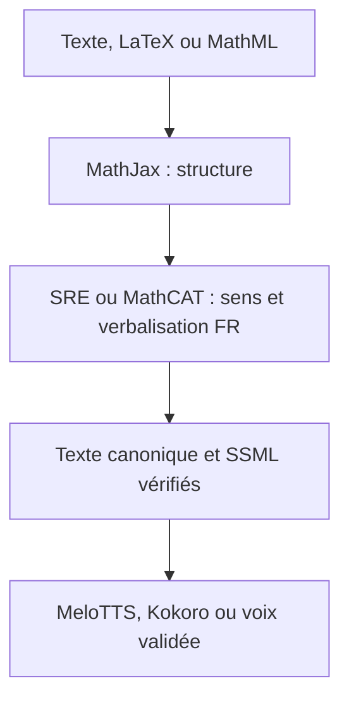

# PQ AI Fabric - Écosystème GitHub contrôlé v5

> Matrice Élève/Administration, lecture scientifique et audit GitHub élargi.

# 44. Correction fonctionnelle v5 : droits Élève et Administration

Les deux applications partagent le même Gateway et le même client, mais **pas les mêmes autorisations**. Le rôle vient de l'identité authentifiée, jamais de la requête.

| Capacité | Élève | Administration | Règle |
|---|---:|---:|---|
| Chat, génération et reformulation de texte | Oui | Oui | modèles locaux ou auto-hébergés validés |
| Lecture de PDF, documents et fichiers | Oui | Oui | scan, extraction, OCR, citations |
| Lecture/compréhension d'images | Oui | Oui | OCR puis vision si nécessaire |
| Lecture/compréhension de vidéos | Oui | Oui | scènes, images clés et transcription |
| Transcription d'un audio ou d'une vidéo | Oui | Oui | traitement local prioritaire |
| Création et édition d'images | Oui | Oui | provenance, quotas et matériel disponible |
| Diagrammes et vues 3D statiques | Oui | Oui | sorties image/SVG/3D, jamais vidéo côté Élève |
| Lecture vocale d'un texte ordinaire | Oui | Oui | TTS d'accessibilité et d'apprentissage |
| Lecture vocale scientifique et mathématique | Oui | Oui | verbalisation sémantique obligatoire avant TTS |
| Génération de sons créatifs | **Non** | Oui | `audio.generate` réservé au rôle `admin` |
| Génération musicale | **Non** | Oui | `music.generate` réservé au rôle `admin` |
| Génération vidéo | **Non** | Oui | `video.generate` réservé au rôle `admin` |
| Montage/transformation vidéo | **Non** | Oui | `video.edit` réservé au rôle `admin` |

La synthèse vocale Élève transforme uniquement un contenu pédagogique en parole. Les vidéos et animations sont préparées dans l'Administration puis publiées aux élèves.

## 44.1 Invariants désormais testés

1. Côté Élève, `video.generate`, `video.edit`, `audio.generate` et `music.generate` ne retournent aucun provider.
2. Côté Administration, elles restent possibles si licence, matériel et coût zéro sont validés.
3. `image.generate` reste disponible à l'élève.
4. `diagram.render` produit `image/svg` ; `3d.render` produit `3d/image`.
5. Le serveur déduit le rôle authentifié et refuse toute promotion côté client.

# 45. Lecture vocale scientifique et mathématique

Un TTS brut ne doit jamais recevoir directement une formule ambiguë. La capacité `audio.read_scientific_text` est un pipeline en trois étapes obligatoires :

| Étape | Projet principal | Repli | Sortie contrôlée |
|---|---|---|---|
| `parse_math` | [MathJax Source](https://github.com/mathjax/MathJax-src) | parseur local déterministe | arbre MathML/structure |
| `verbalize_math` | [Speech Rule Engine](https://github.com/Speech-Rule-Engine/speech-rule-engine) | [MathCAT](https://github.com/daisy/MathCAT) | français canonique + SSML |
| `synthesize_speech` | MeloTTS/Kokoro | Piper ou voix système auditée | audio |

La formulation exacte de SRE ou MathCAT peut varier selon le jeu de règles. PQ ajoute donc une couche de normalisation et un corpus d'acceptation français. Exemples attendus :

| Expression | Lecture attendue |
|---|---|
| `f(x)=x^2+3` | « f de x égale x au carré plus trois » |
| `\frac{a}{b}` | « a sur b » |
| `\sqrt{x+1}` | « racine carrée de x plus un » |
| `\int_0^1 x^2\,dx` | « intégrale de zéro à un de x au carré, d x » |
| `H_2SO_4` | « H deux S O quatre » |

La qualité est validée sur fonctions, fractions, puissances, racines, intégrales, matrices, unités, chimie et ponctuation pédagogique. L'expression source, la verbalisation finale, la locale, le moteur et sa version sont conservés dans la trace ; l'audio seul n'est jamais la source de vérité.

# 46. Fouille GitHub élargie et reproductible

## 46.1 Ce qui a réellement été fouillé

Au 2026-09-19, le relevé reproductible contient :

| Mesure | Résultat |
|---|---:|
| Familles/requêtes de recherche | 30 |
| Résultats retournés avant déduplication | 1940 |
| Correspondances totales annoncées par GitHub, avec recouvrements | 10091 |
| Dépôts uniques conservés | 1656 |
| Dépôts hors catalogue d'exécution | 1635 |
| Dépôts archivés | 57 |
| Licence absente ou `NOASSERTION` | 358 |

Familles interrogées : agents, asr, audio_generation, diarization, document_ai, document_parser, evaluation, image_edit, image_generation, local_api, local_llm, math, mcp, multimodal, music_generation, ocr, pdf, rag, sandbox, science, translation, tts, tts_multilingual, vector, video_generation, video_understanding, vision_language, voice, webgpu, workflow.

Le compte GitHub du projet (`ahdybau1`) est explicitement exclu. L'unité pertinente est le **dépôt**, pas le compte : un compte peut contenir des projets sans rapport, des forks, des données ou des démonstrations.

## 46.2 Limite honnête du mot « tous »

Il est techniquement impossible de certifier « tous les comptes GitHub » : l'inventaire change en continu, les dépôts privés sont inaccessibles, GitHub Search classe et plafonne les résultats, et les mots-clés produisent des faux positifs. Le présent audit est donc une **fouille large, datée et reproductible**, pas une prétention d'exhaustivité absolue.

Les 1656 entrées ne sont ni installées, ni téléchargées, ni exécutées. Elles alimentent un index de découverte. Les statistiques GitHub et licences déclarées sont des indices de tri, jamais une certification de sécurité ou de droit d'usage.

## 46.3 Licences observées

| Licence déclarée | Dépôts |
|---|---:|
| MIT | 599 |
| Apache-2.0 | 479 |
| BSD-2/3-Clause | 40 |
| MPL-2.0 | 15 |
| GPL-2.0/GPL-3.0 | 78 |
| AGPL-3.0 | 66 |
| `UNKNOWN`/`NOASSERTION` | 358 |

# 47. Index de découverte, shortlist et registre approuvé

Trois niveaux empêchent l'installation aveugle :

| Niveau | Taille actuelle | Peut être exécuté ? | Fonction |
|---|---:|---:|---|
| Discovery Index | 1656 dépôts | Non | ne rien rater et relancer les audits |
| Shortlist d'expansion | 50 dépôts | Non | candidats prioritaires à examiner |
| Capability Registry | 100 composants | Seulement après décision du Planner | intégrations documentées et contrôlées |

Le registre comprend désormais **31 capacités** et **100 composants** : **57 approuvés**, **38 conditionnels**, **2 à surveiller** et **3 bloqués**. Même un composant « approuvé » reste soumis au pin de version, au checksum, au scan et au benchmark avant activation réelle.

## 47.1 Shortlist supplémentaire issue du relevé

| Famille | Dépôt | Licence GitHub déclarée | Étoiles au relevé | État PQ |
|---|---|---|---:|---|
| Agents, mémoire et RAG | [langchain-ai/langchain](https://github.com/langchain-ai/langchain) | MIT | 146669 | DISCOVERY — désactivé, revue requise |
| Agents, mémoire et RAG | [infiniflow/ragflow](https://github.com/infiniflow/ragflow) | Apache-2.0 | 90993 | DISCOVERY — désactivé, revue requise |
| Agents, mémoire et RAG | [browser-use/browser-use](https://github.com/browser-use/browser-use) | MIT | 115284 | DISCOVERY — désactivé, revue requise |
| Agents, mémoire et RAG | [Mintplex-Labs/anything-llm](https://github.com/Mintplex-Labs/anything-llm) | MIT | 66217 | DISCOVERY — désactivé, revue requise |
| Agents, mémoire et RAG | [mem0ai/mem0](https://github.com/mem0ai/mem0) | Apache-2.0 | 65643 | DISCOVERY — désactivé, revue requise |
| Agents, mémoire et RAG | [crewAIInc/crewAI](https://github.com/crewAIInc/crewAI) | MIT | 58766 | DISCOVERY — désactivé, revue requise |
| Agents, mémoire et RAG | [HKUDS/LightRAG](https://github.com/HKUDS/LightRAG) | MIT | 39761 | DISCOVERY — désactivé, revue requise |
| Agents, mémoire et RAG | [microsoft/graphrag](https://github.com/microsoft/graphrag) | MIT | 36031 | DISCOVERY — désactivé, revue requise |
| Agents, mémoire et RAG | [getzep/graphiti](https://github.com/getzep/graphiti) | Apache-2.0 | 31010 | DISCOVERY — désactivé, revue requise |
| Agents, mémoire et RAG | [topoteretes/cognee](https://github.com/topoteretes/cognee) | Apache-2.0 | 30839 | DISCOVERY — désactivé, revue requise |
| Agents, mémoire et RAG | [milvus-io/milvus](https://github.com/milvus-io/milvus) | Apache-2.0 | 46160 | DISCOVERY — désactivé, revue requise |
| Documents, PDF et OCR | [ocrmypdf/OCRmyPDF](https://github.com/ocrmypdf/OCRmyPDF) | MPL-2.0 | 34803 | DISCOVERY — désactivé, revue requise |
| Documents, PDF et OCR | [JaidedAI/EasyOCR](https://github.com/JaidedAI/EasyOCR) | Apache-2.0 | 30005 | DISCOVERY — désactivé, revue requise |
| Documents, PDF et OCR | [naptha/tesseract.js](https://github.com/naptha/tesseract.js) | Apache-2.0 | 38716 | DISCOVERY — désactivé, revue requise |
| Documents, PDF et OCR | [hiroi-sora/Umi-OCR](https://github.com/hiroi-sora/Umi-OCR) | MIT | 47394 | DISCOVERY — désactivé, revue requise |
| Documents, PDF et OCR | [clovaai/donut](https://github.com/clovaai/donut) | MIT | 6926 | DISCOVERY — désactivé, revue requise |
| Documents, PDF et OCR | [deepdoctection/deepdoctection](https://github.com/deepdoctection/deepdoctection) | Apache-2.0 | 3260 | DISCOVERY — désactivé, revue requise |
| Parole, transcription et audio | [m-bain/whisperX](https://github.com/m-bain/whisperX) | BSD-2-Clause | 24124 | DISCOVERY — désactivé, revue requise |
| Parole, transcription et audio | [modelscope/FunASR](https://github.com/modelscope/FunASR) | MIT | 20431 | DISCOVERY — désactivé, revue requise |
| Parole, transcription et audio | [PaddlePaddle/PaddleSpeech](https://github.com/PaddlePaddle/PaddleSpeech) | Apache-2.0 | 12685 | DISCOVERY — désactivé, revue requise |
| Parole, transcription et audio | [speechbrain/speechbrain](https://github.com/speechbrain/speechbrain) | Apache-2.0 | 11826 | DISCOVERY — désactivé, revue requise |
| Parole, transcription et audio | [pyannote/pyannote-audio](https://github.com/pyannote/pyannote-audio) | MIT | 10572 | DISCOVERY — désactivé, revue requise |
| Parole, transcription et audio | [coqui-ai/TTS](https://github.com/coqui-ai/TTS) | MPL-2.0 | 46028 | DISCOVERY — désactivé, revue requise |
| Parole, transcription et audio | [myshell-ai/OpenVoice](https://github.com/myshell-ai/OpenVoice) | MIT | 37581 | DISCOVERY — désactivé, revue requise |
| Parole, transcription et audio | [QwenAudio/CosyVoice](https://github.com/QwenAudio/CosyVoice) | Apache-2.0 | 23688 | DISCOVERY — désactivé, revue requise |
| Parole, transcription et audio | [open-mmlab/Amphion](https://github.com/open-mmlab/Amphion) | MIT | 10303 | DISCOVERY — désactivé, revue requise |
| Image, vidéo et vision | [invoke-ai/InvokeAI](https://github.com/invoke-ai/InvokeAI) | Apache-2.0 | 28247 | DISCOVERY — désactivé, revue requise |
| Image, vidéo et vision | [AUTOMATIC1111/stable-diffusion-webui](https://github.com/AUTOMATIC1111/stable-diffusion-webui) | AGPL-3.0 | 165020 | DISCOVERY — désactivé, revue requise |
| Image, vidéo et vision | [Wan-Video/Wan2.2](https://github.com/Wan-Video/Wan2.2) | Apache-2.0 | 17552 | DISCOVERY — désactivé, revue requise |
| Image, vidéo et vision | [HKUDS/ViMax](https://github.com/HKUDS/ViMax) | MIT | 12424 | DISCOVERY — désactivé, revue requise |
| Image, vidéo et vision | [m87-labs/moondream](https://github.com/m87-labs/moondream) | Apache-2.0 | 10050 | DISCOVERY — désactivé, revue requise |
| Image, vidéo et vision | [Blaizzy/mlx-vlm](https://github.com/Blaizzy/mlx-vlm) | MIT | 5511 | DISCOVERY — désactivé, revue requise |
| Image, vidéo et vision | [deepseek-ai/DeepSeek-VL2](https://github.com/deepseek-ai/DeepSeek-VL2) | MIT | 5375 | DISCOVERY — désactivé, revue requise |
| Image, vidéo et vision | [NVlabs/VILA](https://github.com/NVlabs/VILA) | Apache-2.0 | 3863 | DISCOVERY — désactivé, revue requise |
| Traduction, mathématiques et sciences | [argosopentech/argos-translate](https://github.com/argosopentech/argos-translate) | MIT | 6482 | DISCOVERY — désactivé, revue requise |
| Traduction, mathématiques et sciences | [OpenNMT/CTranslate2](https://github.com/OpenNMT/CTranslate2) | MIT | 4678 | DISCOVERY — désactivé, revue requise |
| Traduction, mathématiques et sciences | [davidedc/Algebrite](https://github.com/davidedc/Algebrite) | MIT | 1002 | DISCOVERY — désactivé, revue requise |
| Traduction, mathématiques et sciences | [asc-community/AngouriMath](https://github.com/asc-community/AngouriMath) | MIT | 832 | DISCOVERY — désactivé, revue requise |
| Traduction, mathématiques et sciences | [flintlib/flint](https://github.com/flintlib/flint) | LGPL-3.0 | 653 | DISCOVERY — désactivé, revue requise |
| Traduction, mathématiques et sciences | [K-Dense-AI/scientific-agent-skills](https://github.com/K-Dense-AI/scientific-agent-skills) | MIT | 45621 | DISCOVERY — désactivé, revue requise |
| Traduction, mathématiques et sciences | [gonum/gonum](https://github.com/gonum/gonum) | BSD-3-Clause | 8427 | DISCOVERY — désactivé, revue requise |
| Traduction, mathématiques et sciences | [stdlib-js/stdlib](https://github.com/stdlib-js/stdlib) | Apache-2.0 | 5966 | DISCOVERY — désactivé, revue requise |
| Évaluation, outils et sandbox | [comet-ml/opik](https://github.com/comet-ml/opik) | Apache-2.0 | 22132 | DISCOVERY — désactivé, revue requise |
| Évaluation, outils et sandbox | [evidentlyai/evidently](https://github.com/evidentlyai/evidently) | Apache-2.0 | 7926 | DISCOVERY — désactivé, revue requise |
| Évaluation, outils et sandbox | [Giskard-AI/giskard-oss](https://github.com/Giskard-AI/giskard-oss) | Apache-2.0 | 5827 | DISCOVERY — désactivé, revue requise |
| Évaluation, outils et sandbox | [open-compass/VLMEvalKit](https://github.com/open-compass/VLMEvalKit) | Apache-2.0 | 4401 | DISCOVERY — désactivé, revue requise |
| Évaluation, outils et sandbox | [judge0/judge0](https://github.com/judge0/judge0) | GPL-3.0 | 4437 | DISCOVERY — désactivé, revue requise |
| Évaluation, outils et sandbox | [bytedance/deer-flow](https://github.com/bytedance/deer-flow) | MIT | 82693 | DISCOVERY — désactivé, revue requise |
| Évaluation, outils et sandbox | [upstash/context7](https://github.com/upstash/context7) | MIT | 62204 | DISCOVERY — désactivé, revue requise |
| Évaluation, outils et sandbox | [ChromeDevTools/chrome-devtools-mcp](https://github.com/ChromeDevTools/chrome-devtools-mcp) | Apache-2.0 | 52302 | DISCOVERY — désactivé, revue requise |

Cette shortlist n'accorde aucune confiance implicite. AGPL/GPL/MPL imposent une revue d'architecture et de distribution ; chaque modèle ou voix impose une revue d'artefact distincte ; les projets d'agents, MCP, navigation et sandbox reçoivent les contrôles réseau et permissions les plus stricts.

# 48. Mise en oeuvre ajoutée dans la branche

| Élément | Résultat |
|---|---|
| Catalogue v2 | rôles, 31 capacités, 100 composants, étapes de pipeline |
| Planner | refus par rôle et détection des étapes non couvertes |
| Route authentifiée | rôle dérivé du compte, jamais accepté depuis le client |
| Lecture scientifique | MathJax + Speech Rule Engine + MathCAT + TTS |
| Corpus français | fonctions, fractions, racines, intégrales, chimie et unités |
| Discovery Index | 1 656 dépôts compactés, non exécutables |
| Shortlist | 50 projets supplémentaires, tous désactivés |
| Validation | politique zéro coût, matrice des rôles et pipeline scientifique |

Ordre d'intégration recommandé : lecture scientifique d'abord ; documents/OCR et transcription ensuite ; image côté deux applications ; génération audio/musique/vidéo uniquement dans les workers Administration ; agents, MCP et sandbox en dernier après durcissement.

# 49. Décision finale v5

Oui, l'écosystème libre et auto-hébergeable est suffisamment riche pour construire les capacités demandées. Non, aucun inventaire GitHub ne rend les calculs lourds illimités ou sans coût d'infrastructure, et aucun dépôt ne doit être branché automatiquement parce qu'il est public.

La cible confirmée est donc : **deux applications, un socle partagé, des droits différents**. L'Élève peut converser, générer du texte et des images, lire les fichiers et médias, et écouter une lecture scientifique correcte. L'Administration peut en plus générer et monter vidéos, sons et musiques. Le système ne dépend d'aucune API payante, d'aucune carte bancaire et d'aucun free tier externe critique.
