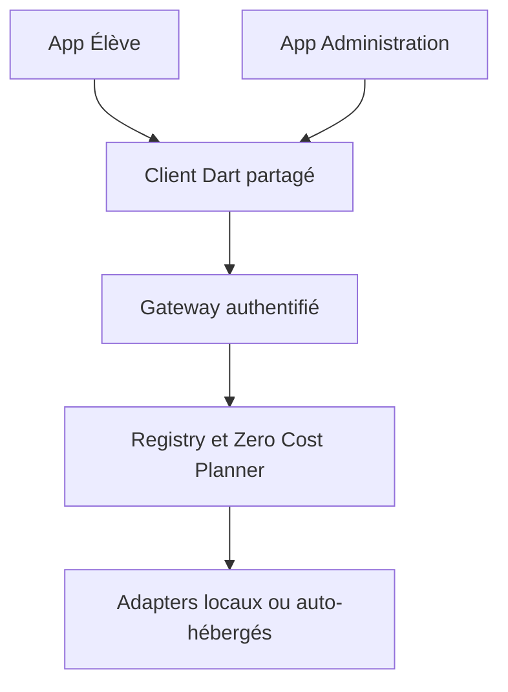

# PQ AI Fabric - Écosystème GitHub contrôlé

> Extrait opérationnel du cahier des charges v4. Les agents et chats existants sont conservés.

# 36. Certification de l'écosystème GitHub

## 36.1 Réponse formelle

Oui : il existe suffisamment de projets GitHub sérieux pour couvrir la lecture et la génération de texte, documents, images, audio, musique et vidéo, ainsi que l'OCR, la recherche, le RAG, l'orchestration, les outils scientifiques, l'exécution de code, la sécurité et l'évaluation.

Non : « prendre absolument tous les GitHub » ne constitue ni une architecture ni une garantie de gratuité. GitHub contient des centaines de millions de dépôts, des forks, des projets abandonnés, des licences incompatibles, du code malveillant et des modèles dont la licence diffère de celle du code. PQ doit donc rendre **tout ajout possible**, mais n'activer que les composants passés par le Registry, le Zero Cost Guard, la revue de licence, le scan de sécurité et les benchmarks.

Au 2026-09-19, le catalogue machine-readable contient **30 capacités** et **97 candidats** : **54 approuvés**, **38 conditionnels**, **2 à surveiller** et **3 bloqués**. Cette certification porte sur la politique de sélection et les métadonnées vérifiées à cette date ; elle ne remplace pas une revue juridique lors de chaque mise à jour de code ou de poids.

## 36.2 Ce qu'est réellement un « outil GitHub »

| Objet | Rôle | Contrôle obligatoire |
|---|---|---|
| Dépôt de code | runtime, bibliothèque, application ou serveur | licence du code, activité, vulnérabilités, reproductibilité |
| Poids de modèle | capacité IA réelle | licence distincte, provenance, taille, langues, matériel |
| Agent | boucle de décision utilisant modèles et outils | permissions, budget, arrêt, observabilité |
| Skill | procédure réutilisable et contrainte | source, version, capacités autorisées |
| Serveur MCP | exposition standardisée d'outils | allowlist, authentification, schémas, sandbox |
| Adapter | contrat PQ vers un runtime | timeout, quotas, format, fallback, tests |
| Workflow | composition de plusieurs capacités | reprise, idempotence, traçage, compensation |

# 37. Implémentation ajoutée au projet pq learn

## 37.1 Principe

Les chats et agents existants restent en place. La nouvelle couche n'est pas un chatbot supplémentaire : elle leur fournit un catalogue partagé et un planificateur déterministe. L'application Élève et l'application Administration utilisent le même Gateway et le même client Dart, sans intégrer directement 97 SDK différents.

## 37.2 Fichiers et contrats

| Élément | Emplacement | Fonction |
|---|---|---|
| Catalogue JSON | `gateway/config/capability_catalog.json` | 30 capacités, 97 candidats, licences et contraintes |
| Modèles typés | `gateway/app/capabilities/models.py` | schéma Pydantic et invariants zéro coût |
| Registry/Planner | `gateway/app/capabilities/registry.py` | validation, filtrage, classement et dégradation |
| Routes partagées | `gateway/app/capabilities/routes.py` | inventaire et planification authentifiés |
| Validateur CI | `gateway/scripts/validate_capability_catalog.py` | échec si coût, carte, doublon ou capacité vide |
| Tests | `gateway/tests/test_capability_registry.py` | licences, GPU, offline, capacités inconnues |
| Client Flutter/Dart | `packages/pq_ai_fabric_client/` | contrat unique pour les deux applications |

API exposée :

- `GET /v1/capabilities` : inventaire compact ;
- `GET /v1/capabilities/{capability_id}` : détail et providers ;
- `POST /v1/capabilities/plan` : plan compatible avec cible, matériel, réseau, GPU et licence.

Le Planner n'exécute encore aucun binaire tiers : il décide d'abord si un provider est admissible. Les adapters d'exécution doivent être ajoutés par lots après test. Cette séparation empêche qu'un simple ajout au catalogue déclenche un téléchargement, une exécution ou une fuite de données.

## 37.3 Invariants exécutables

1. `mandatory_cost_eur` reste égal à zéro.
2. Les API payantes et cartes bancaires restent interdites.
3. Un provider bloqué ou en veille ne peut pas devenir `core`.
4. Un provider activé par défaut doit être approuvé.
5. Une licence conditionnelle exige un opt-in explicite.
6. Une demande sans GPU élimine les providers GPU-only.
7. Une demande offline élimine les providers nécessitant Internet.
8. Une capacité inconnue échoue explicitement.
9. Chaque capacité conserve une stratégie de dégradation gratuite.
10. Les poids et voix sont revus séparément du code.

# 38. Couverture des 30 capacités

| Capacité | Entrées -> sorties | Candidats | Approuvés | Dégradation gratuite |
|---|---|---:|---:|---|
| `text.generate` | text -> text | 12 | 1 | template/cache; moteur déterministe; modèle local compact; file différée |
| `vision.understand` | image, text -> text, json | 18 | 3 | OCR local; détection classique; description indisponible explicitement |
| `document.parse` | document -> text, markdown, json | 10 | 5 | extracteur natif; OCR page par page; mise en revue humaine |
| `ocr.extract` | image, document -> text, json | 8 | 4 | Tesseract; saisie/revue humaine |
| `image.generate` | text, image -> image | 6 | 2 | SVG/Canvas déterministe; bibliothèque d’illustrations; file GPU différée |
| `image.edit` | image, text -> image | 7 | 4 | libvips/ImageMagick; édition manuelle; file GPU différée |
| `image.segment` | image, text -> mask, json | 4 | 3 | OpenCV/MediaPipe; revue manuelle |
| `image.restore` | image -> image | 3 | 2 | redimensionnement classique; original conservé |
| `audio.transcribe` | audio, video -> text, json | 12 | 3 | modèle ASR compact; file locale différée; saisie manuelle |
| `audio.synthesize` | text -> audio | 7 | 3 | voix système; modèle TTS compact; texte seul |
| `audio.generate` | text, audio -> audio | 8 | 3 | sons procéduraux; banque libre; file GPU différée |
| `music.generate` | text, audio -> audio | 4 | 1 | MIDI/procédural; banque libre; file GPU différée |
| `audio.separate` | audio -> audio | 5 | 0 | filtres FFmpeg; original conservé |
| `video.understand` | video, text -> text, json | 12 | 7 | ASR + images clés; métadonnées seulement; file différée |
| `video.generate` | text, image, audio -> video | 10 | 5 | Manim/SVG/Canvas; diaporama narré; file GPU différée |
| `video.edit` | video, audio, image -> video | 6 | 2 | FFmpeg/GStreamer; édition différée |
| `media.transcode` | audio, video, image -> audio, video, image | 5 | 2 | format original; traitement serveur différé |
| `embeddings.generate` | text, image -> vector | 9 | 1 | BM25/FTS5; modèle compact ONNX |
| `retrieval.search` | text, vector -> json, text | 10 | 8 | FTS5/BM25; pgvector; cache |
| `agent.orchestrate` | json, text -> json, text | 9 | 8 | workflow déterministe; file persistante; validation humaine |
| `tool.protocol` | json -> json | 7 | 6 | outil natif allowlisté; fonction indisponible explicitement |
| `code.execute` | code -> text, json, file | 5 | 3 | interpréteur navigateur; validation statique; exécution refusée |
| `math.solve` | text, formula -> json, formula, text | 3 | 2 | SymPy; calcul numérique; revue humaine |
| `science.simulate` | json, formula -> json, chart | 10 | 4 | moteur déterministe; simulation simplifiée |
| `diagram.render` | text, json -> image, video, svg | 5 | 1 | SVG/Canvas; rendu statique |
| `3d.render` | json, text -> 3d, image, video | 6 | 1 | Three.js/Babylon.js; schéma 2D |
| `translation.local` | text -> text | 2 | 0 | glossaire; mémoire de traduction; texte source |
| `safety.scan` | file, repository -> json | 5 | 4 | quarantaine; refus d’exécution |
| `observability.evaluate` | trace, dataset -> metrics, report | 5 | 5 | logs locaux; échantillonnage |
| `sync.offline` | json, file -> json, file | 3 | 3 | queue locale; export/import manuel |

Une capacité affichant zéro provider approuvé n'est pas supprimée : elle reste disponible via une stratégie déterministe, un artefact validé, une revue de licence ou une file différée. Elle ne doit jamais basculer silencieusement vers un service payant.

# 39. Catalogue GitHub contrôlé

## 39.1 Légende

- **ADOPT** : utilisable après tests de version, checksum et benchmark.
- **REVIEW** : le code peut être libre mais le modèle, la voix, l'asset ou la configuration doit être validé.
- **WATCH** : projet non prioritaire, archivé ou insuffisamment stable.
- **BLOCK** : incompatibilité connue avec le produit commercial ou projet remplacé.
- **core/optional/experimental/rejected** : priorité d'intégration PQ, pas une note de popularité.

### Runtimes LLM et multimodaux

| Projet | Licence code | Licence modèle/artefact | Commercial | Statut | Niveau |
|---|---|---|---|---|---|
| [llama.cpp](https://github.com/ggml-org/llama.cpp) | MIT | per-model | review | REVIEW | core |
| [MLC LLM](https://github.com/mlc-ai/mlc-llm) | Apache-2.0 | per-model | review | REVIEW | optional |
| [ONNX Runtime](https://github.com/microsoft/onnxruntime) | MIT | per-model | review | REVIEW | core |
| [ExecuTorch](https://github.com/pytorch/executorch) | BSD-3-Clause | per-model | review | REVIEW | optional |
| [LiteRT](https://github.com/google-ai-edge/LiteRT) | Apache-2.0 | per-model | review | REVIEW | optional |
| [WebLLM](https://github.com/mlc-ai/web-llm) | Apache-2.0 | per-model | review | REVIEW | optional |
| [Transformers.js](https://github.com/huggingface/transformers.js) | Apache-2.0 | per-model | review | REVIEW | optional |
| [vLLM](https://github.com/vllm-project/vllm) | Apache-2.0 | per-model | review | REVIEW | optional |
| [Ollama](https://github.com/ollama/ollama) | MIT | per-model | review | REVIEW | optional |
| [LocalAI](https://github.com/mudler/LocalAI) | MIT | per-model | review | REVIEW | optional |
| [Transformers](https://github.com/huggingface/transformers) | Apache-2.0 | per-model | review | REVIEW | optional |
| [Qwen3-VL](https://github.com/QwenLM/Qwen3-VL) | Apache-2.0 | Apache-2.0 | allowed | ADOPT | optional |

### Documents, OCR, image et vision

| Projet | Licence code | Licence modèle/artefact | Commercial | Statut | Niveau |
|---|---|---|---|---|---|
| [InternVL](https://github.com/OpenGVLab/InternVL) | MIT | per-model | review | REVIEW | experimental |
| [LLaVA-NeXT](https://github.com/LLaVA-VL/LLaVA-NeXT) | Apache-2.0 | per-model | review | REVIEW | experimental |
| [Docling](https://github.com/docling-project/docling) | MIT | per-model | review | REVIEW | core |
| [MarkItDown](https://github.com/microsoft/markitdown) | MIT | per-model | review | REVIEW | optional |
| [PaddleOCR](https://github.com/PaddlePaddle/PaddleOCR) | Apache-2.0 | Apache-2.0/per-model | allowed | ADOPT | core |
| [Tesseract OCR](https://github.com/tesseract-ocr/tesseract) | Apache-2.0 | Apache-2.0 | allowed | ADOPT | core |
| [MinerU](https://github.com/opendatalab/MinerU) | MinerU Open Source License | per-model | review | REVIEW | experimental |
| [Surya](https://github.com/datalab-to/surya) | Apache-2.0 | modified OpenRAIL-M | conditional | REVIEW | experimental |
| [Apache Tika](https://github.com/apache/tika) | Apache-2.0 | same-as-code | allowed | ADOPT | optional |
| [pypdf](https://github.com/py-pdf/pypdf) | BSD-3-Clause | same-as-code | allowed | ADOPT | optional |
| [OpenCV](https://github.com/opencv/opencv) | Apache-2.0 | same-as-code | allowed | ADOPT | core |
| [MediaPipe](https://github.com/google-ai-edge/mediapipe) | Apache-2.0 | per-model | review | REVIEW | optional |
| [SAM 2](https://github.com/facebookresearch/sam2) | Apache-2.0/BSD-3-Clause | Apache-2.0 | allowed | ADOPT | optional |
| [Grounding DINO](https://github.com/IDEA-Research/GroundingDINO) | Apache-2.0 | Apache-2.0 | allowed | ADOPT | optional |
| [OpenCLIP](https://github.com/mlfoundations/open_clip) | MIT | per-model | review | REVIEW | optional |
| [Real-ESRGAN](https://github.com/xinntao/Real-ESRGAN) | BSD-3-Clause | per-model | review | REVIEW | optional |
| [libvips](https://github.com/libvips/libvips) | LGPL-2.1+ | same-as-code | allowed | ADOPT | core |
| [ImageMagick](https://github.com/ImageMagick/ImageMagick) | ImageMagick License | same-as-code | allowed | ADOPT | optional |
| [Diffusers](https://github.com/huggingface/diffusers) | Apache-2.0 | per-model | review | REVIEW | core |
| [ComfyUI](https://github.com/Comfy-Org/ComfyUI) | GPL-3.0 | per-model | review | REVIEW | optional |
| [Qwen-Image](https://github.com/QwenLM/Qwen-Image) | Apache-2.0 | Apache-2.0 | allowed | ADOPT | optional |
| [FLUX.1 schnell](https://github.com/black-forest-labs/flux) | Apache-2.0 | Apache-2.0 | allowed | ADOPT | optional |
| [FLUX.1 dev family](https://github.com/black-forest-labs/flux) | Apache-2.0 | FLUX non-commercial | blocked | BLOCK | rejected |
| [LlamaIndex](https://github.com/run-llama/llama_index) | MIT | same-as-code | allowed | ADOPT | optional |

### Parole, audio et musique

| Projet | Licence code | Licence modèle/artefact | Commercial | Statut | Niveau |
|---|---|---|---|---|---|
| [whisper.cpp](https://github.com/ggml-org/whisper.cpp) | MIT | MIT | allowed | ADOPT | core |
| [faster-whisper](https://github.com/SYSTRAN/faster-whisper) | MIT | MIT/per-model | allowed | ADOPT | optional |
| [sherpa-onnx](https://github.com/k2-fsa/sherpa-onnx) | Apache-2.0 | per-model | review | REVIEW | core |
| [Vosk](https://github.com/alphacep/vosk-api) | Apache-2.0 | Apache-2.0/per-model | allowed | ADOPT | optional |
| [Kokoro](https://github.com/hexgrad/kokoro) | Apache-2.0 | Apache-2.0 | allowed | ADOPT | core |
| [MeloTTS](https://github.com/myshell-ai/MeloTTS) | MIT | MIT | allowed | ADOPT | optional |
| [Piper](https://github.com/OHF-Voice/piper1-gpl) | GPL-3.0 | per-voice | conditional | REVIEW | optional |
| [Bark](https://github.com/suno-ai/bark) | MIT | MIT | allowed | ADOPT | experimental |
| [ACE-Step](https://github.com/ace-step/ACE-Step) | Apache-2.0 | Apache-2.0 | allowed | ADOPT | optional |
| [stable-audio-tools](https://github.com/Stability-AI/stable-audio-tools) | MIT | per-model/gated | conditional | REVIEW | experimental |
| [AudioCraft / MusicGen](https://github.com/facebookresearch/audiocraft) | MIT | CC-BY-NC-4.0 | blocked | BLOCK | rejected |
| [Demucs](https://github.com/facebookresearch/demucs) | MIT | per-model | review | WATCH | experimental |
| [FFmpeg](https://github.com/FFmpeg/FFmpeg) | LGPL-2.1+/GPL-2+ per build | same-as-build | conditional | REVIEW | core |
| [GStreamer](https://github.com/GStreamer/gstreamer) | LGPL-2.1+ | per-plugin | conditional | REVIEW | optional |
| [ffmpeg.wasm](https://github.com/ffmpegwasm/ffmpeg.wasm) | MIT + FFmpeg build license | same-as-build | conditional | REVIEW | optional |
| [LTX-Video](https://github.com/Lightricks/LTX-Video) | Apache-2.0 | Apache-2.0/per-model | allowed | ADOPT | experimental |

### Vidéo et média

| Projet | Licence code | Licence modèle/artefact | Commercial | Statut | Niveau |
|---|---|---|---|---|---|
| [PySceneDetect](https://github.com/Breakthrough/PySceneDetect) | BSD-3-Clause | same-as-code | allowed | ADOPT | optional |
| [Decord](https://github.com/dmlc/decord) | Apache-2.0 | same-as-code | allowed | ADOPT | optional |
| [Wan 2.1](https://github.com/Wan-Video/Wan2.1) | Apache-2.0 | Apache-2.0 | allowed | ADOPT | experimental |
| [CogVideoX-2B](https://github.com/zai-org/CogVideo) | Apache-2.0 | Apache-2.0 | allowed | ADOPT | experimental |
| [FramePack](https://github.com/lllyasviel/FramePack) | Apache-2.0 | per-model | review | REVIEW | experimental |
| [Mochi 1](https://github.com/genmoai/mochi) | Apache-2.0 | Apache-2.0 | allowed | ADOPT | experimental |
| [Open-Sora](https://github.com/hpcaitech/Open-Sora) | Apache-2.0 | per-checkpoint | review | WATCH | experimental |
| [Manim Community](https://github.com/ManimCommunity/manim) | MIT | same-as-code | allowed | ADOPT | core |

### RAG, orchestration et protocoles

| Projet | Licence code | Licence modèle/artefact | Commercial | Statut | Niveau |
|---|---|---|---|---|---|
| [pgvector](https://github.com/pgvector/pgvector) | PostgreSQL License | same-as-code | allowed | ADOPT | core |
| [Qdrant](https://github.com/qdrant/qdrant) | Apache-2.0 | same-as-code | allowed | ADOPT | optional |
| [sqlite-vec](https://github.com/asg017/sqlite-vec) | MIT/Apache-2.0 dual | same-as-code | allowed | ADOPT | optional |
| [FAISS](https://github.com/facebookresearch/faiss) | MIT | same-as-code | allowed | ADOPT | optional |
| [LanceDB](https://github.com/lancedb/lancedb) | Apache-2.0 | same-as-code | allowed | ADOPT | optional |
| [Sentence Transformers](https://github.com/huggingface/sentence-transformers) | Apache-2.0 | per-model | review | REVIEW | core |
| [Haystack](https://github.com/deepset-ai/haystack) | Apache-2.0 | same-as-code | allowed | ADOPT | optional |
| [LangGraph](https://github.com/langchain-ai/langgraph) | MIT | same-as-code | allowed | ADOPT | core |
| [Microsoft Agent Framework](https://github.com/microsoft/agent-framework) | MIT | same-as-code | allowed | ADOPT | optional |
| [smolagents](https://github.com/huggingface/smolagents) | Apache-2.0 | same-as-code | allowed | ADOPT | optional |
| [PydanticAI](https://github.com/pydantic/pydantic-ai) | MIT | same-as-code | allowed | ADOPT | optional |
| [DSPy](https://github.com/stanfordnlp/dspy) | MIT | same-as-code | allowed | ADOPT | experimental |
| [AutoGen](https://github.com/microsoft/autogen) | MIT/CC-BY-4.0 | same-as-code | allowed | BLOCK | rejected |
| [MCP Servers](https://github.com/modelcontextprotocol/servers) | MIT | per-server | review | REVIEW | core |
| [FastMCP](https://github.com/PrefectHQ/fastmcp) | Apache-2.0 | same-as-code | allowed | ADOPT | optional |
| [Wasmtime](https://github.com/bytecodealliance/wasmtime) | Apache-2.0 WITH LLVM-exception | same-as-code | allowed | ADOPT | core |
| [Ragas](https://github.com/explodinggradients/ragas) | Apache-2.0 | same-as-code | allowed | ADOPT | optional |

### Code, sciences, rendu et collaboration

| Projet | Licence code | Licence modèle/artefact | Commercial | Statut | Niveau |
|---|---|---|---|---|---|
| [Pyodide](https://github.com/pyodide/pyodide) | MPL-2.0 | package-dependent | conditional | REVIEW | core |
| [JupyterLite](https://github.com/jupyterlite/jupyterlite) | BSD-3-Clause | package-dependent | conditional | REVIEW | optional |
| [gVisor](https://github.com/google/gvisor) | Apache-2.0 | same-as-code | allowed | ADOPT | optional |
| [Firecracker](https://github.com/firecracker-microvm/firecracker) | Apache-2.0 | same-as-code | allowed | ADOPT | experimental |
| [SymPy](https://github.com/sympy/sympy) | BSD-3-Clause | same-as-code | allowed | ADOPT | core |
| [SciPy](https://github.com/scipy/scipy) | BSD-3-Clause | same-as-code | allowed | ADOPT | core |
| [RDKit](https://github.com/rdkit/rdkit) | BSD-3-Clause | same-as-code | allowed | ADOPT | optional |
| [Open Babel](https://github.com/openbabel/openbabel) | GPL-2.0 | same-as-code | conditional | REVIEW | optional |
| [Cantera](https://github.com/Cantera/cantera) | BSD-3-Clause | same-as-code | allowed | ADOPT | optional |
| [three.js](https://github.com/mrdoob/three.js) | MIT | asset-dependent | review | REVIEW | core |
| [Babylon.js](https://github.com/BabylonJS/Babylon.js) | Apache-2.0 | asset-dependent | review | REVIEW | optional |
| [Godot Engine](https://github.com/godotengine/godot) | MIT | asset-dependent | review | REVIEW | optional |
| [Yjs](https://github.com/yjs/yjs) | MIT | same-as-code | allowed | ADOPT | core |
| [Automerge](https://github.com/automerge/automerge) | MIT | same-as-code | allowed | ADOPT | optional |

### Sécurité, observabilité et qualité

| Projet | Licence code | Licence modèle/artefact | Commercial | Statut | Niveau |
|---|---|---|---|---|---|
| [Microsoft Presidio](https://github.com/microsoft/presidio) | MIT | per-model | review | REVIEW | core |
| [Trivy](https://github.com/aquasecurity/trivy) | Apache-2.0 | same-as-code | allowed | ADOPT | core |
| [Syft](https://github.com/anchore/syft) | Apache-2.0 | same-as-code | allowed | ADOPT | core |
| [OpenTelemetry Python](https://github.com/open-telemetry/opentelemetry-python) | Apache-2.0 | same-as-code | allowed | ADOPT | core |
| [MLflow](https://github.com/mlflow/mlflow) | Apache-2.0 | same-as-code | allowed | ADOPT | optional |
| [Promptfoo](https://github.com/promptfoo/promptfoo) | MIT | same-as-code | allowed | ADOPT | optional |

## 39.2 Blocages explicites

| Élément | Décision | Motif |
|---|---|---|
| AudioCraft/MusicGen | BLOCK | poids sous CC-BY-NC 4.0, non adaptés au produit commercial |
| FLUX.1 dev et dérivés non commerciaux | BLOCK | licence des poids non commerciale ; seul `schnell` Apache-2.0 est retenu |
| AutoGen | BLOCK pour nouveau développement | projet en maintenance ; Microsoft Agent Framework est le successeur retenu |
| Ultralytics | hors catalogue initial | AGPL-3.0 ou licence commerciale ; décision juridique/architecturale requise |
| Surya | REVIEW | poids sous licence modifiée avec conditions d'usage |
| MinerU | REVIEW | licence modifiée et modèles à contrôler séparément |
| Demucs | WATCH | dépôt archivé ; pas de dépendance de coeur |

# 40. Pipelines multimodaux cibles

## 40.1 Lire un fichier

1. Détection MIME réelle et scan de sécurité.
2. Extraction native par type ; Docling/Tika/pypdf pour la structure.
3. OCR local PaddleOCR/Tesseract si le document est scanné.
4. Découpage, métadonnées, embeddings locaux et index pgvector/FTS.
5. Citations obligatoires vers page, bloc et version du fichier.

## 40.2 Lire une image ou une vidéo

1. Suppression des métadonnées non nécessaires et contrôle de taille.
2. OCR et vision classique avant VLM.
3. Échantillonnage vidéo, scènes, images clés et transcription audio.
4. VLM Apache-2.0 seulement si nécessaire et matériel compatible.
5. Résultat structuré, confiance, provenance et possibilité de revue.

## 40.3 Lire et produire de l'audio

1. FFmpeg pour normaliser le flux.
2. whisper.cpp/faster-whisper/Vosk pour la transcription locale.
3. Kokoro/MeloTTS ou voix système pour la synthèse.
4. ACE-Step pour une musique originale lorsque le GPU existe.
5. Texte, partition, samples et licences conservés comme provenance.

## 40.4 Produire une image ou une vidéo

1. Chercher d'abord une ressource validée ou produire SVG/Canvas/Manim.
2. Qwen-Image ou FLUX.1 schnell pour l'image générative, après benchmark.
3. LTX-Video, Wan 2.1, CogVideoX-2B ou Mochi comme options GPU expérimentales.
4. ComfyUI peut orchestrer les workflows locaux, avec noeuds API payants désactivés.
5. Si aucun GPU n'est disponible : file différée, animation déterministe ou contenu pré-calculé.

# 41. Plan d'adoption sans dette incontrôlée

| Vague | Contenu | Condition de sortie |
|---|---|---|
| G0 - fondation | Registry, Planner, API, client Dart, tests | aucune régression, coût nul prouvé |
| G1 - lecture | fichiers, OCR, transcription, transcodage | corpus réel, CPU et offline validés |
| G2 - recherche | embeddings locaux, pgvector/FTS, citations | précision et isolation par profil |
| G3 - production légère | SVG, diagrammes, TTS, Manim | appareils faibles et accessibilité |
| G4 - génération GPU | images, musique, vidéo | worker volontaire, quota, licence, provenance |
| G5 - protocoles | MCP et adapters supplémentaires | allowlist, sandbox et tests d'injection |
| G6 - optimisation | benchmarks et remplacement des mauvais candidats | un primaire et un fallback par capacité |

Le catalogue peut grandir sans limite artificielle, mais l'installation active doit rester petite. Une nouvelle technologie entre par pull request avec : licence, checksum, SBOM, propriétaire, capacité, adapter, matériel minimal, cas de test, benchmark, fallback et procédure de retrait.

# 42. Matrice de tests obligatoire

| Axe | Test minimum |
|---|---|
| Zéro coût | panne totale des services externes ; aucune demande de carte ; aucun fallback payant |
| Licence | code et poids vérifiés séparément ; blocage si inconnu |
| Sécurité | fichiers hostiles, prompt injection, SSRF, archive bomb, secrets, sandbox |
| Mobile faible | L0/L1 sans modèle lourd, batterie et mémoire mesurées |
| Offline | lancement, cache, recherche, reprise et synchronisation |
| Qualité | français et programmes ciblés ; précision par matière et classe |
| Média | durée, résolution, latence, VRAM/RAM, provenance |
| Résilience | timeout, crash worker, reprise, dégradation et idempotence |
| Confidentialité | profil non autorisé refusé ; traces sans données sensibles |
| Applications | même contrat vérifié dans Élève et Administration |

# 43. Décision finale v4

L'écosystème GitHub est **suffisant pour construire l'ensemble des capacités demandées**, mais il ne rend pas la puissance de calcul gratuite et il ne justifie pas d'installer tous les dépôts. La stratégie correcte est un **catalogue total, une activation sélective et des adapters remplaçables**.

PQ peut donc intégrer progressivement texte, documents, images, audio, musique, vidéo, code et sciences sans API payante obligatoire. La promesse vérifiable reste : coeur utile sans Internet, aucune carte, aucun basculement payant, et refus automatique de toute licence ou provenance non validée.
